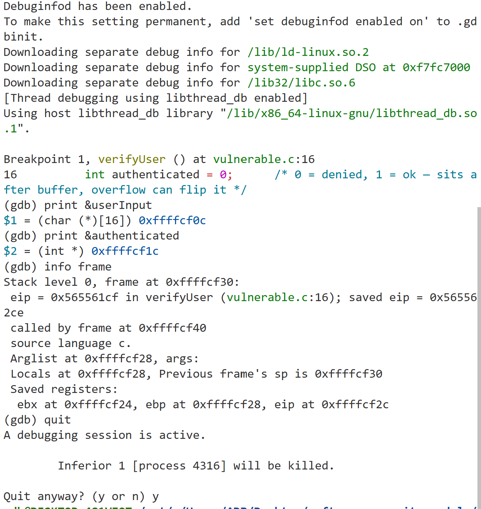
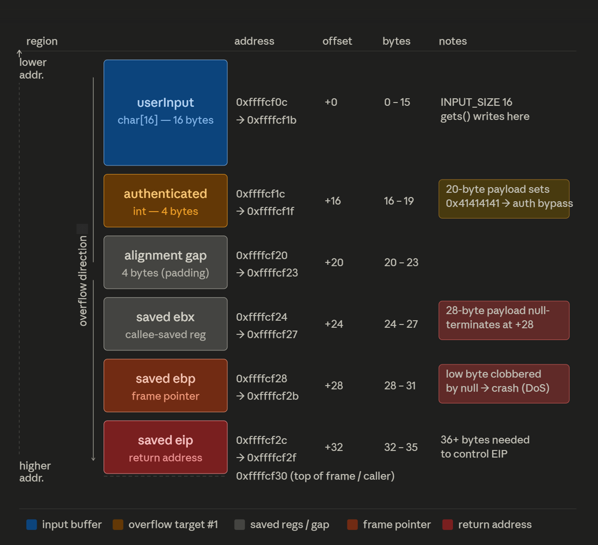
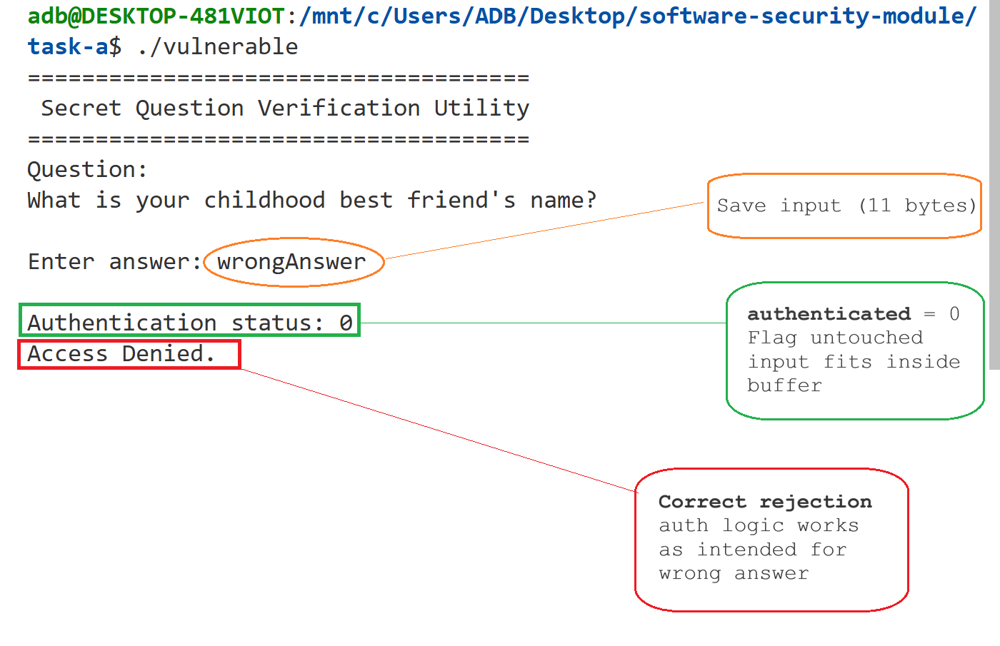
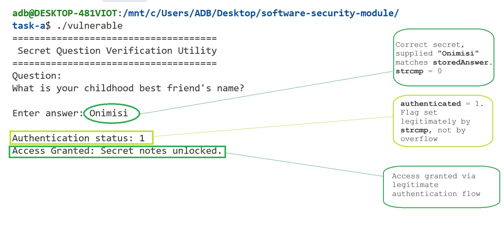
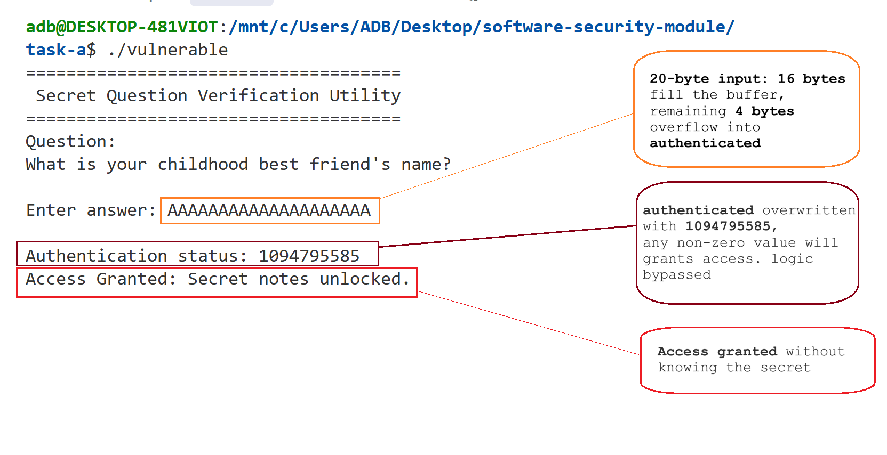
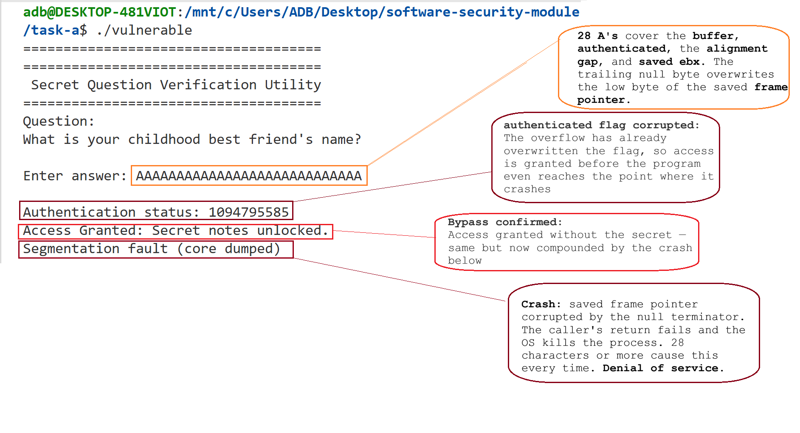
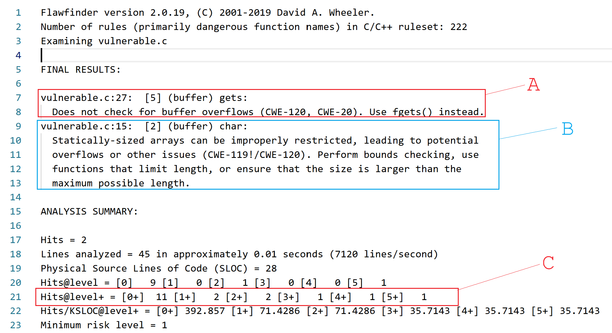
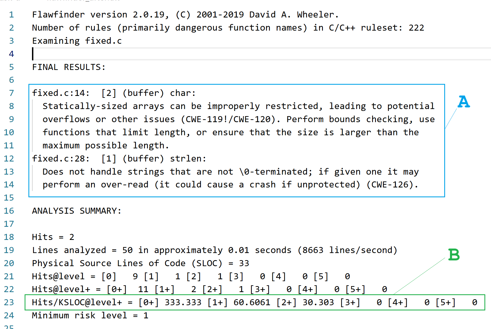
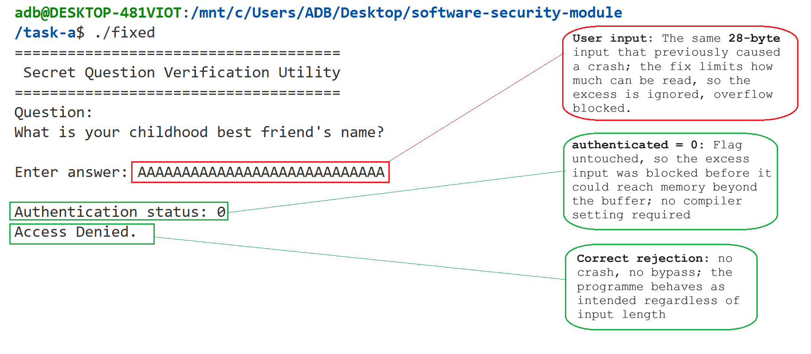

# Task A: Vulnerability Discovery and Remediation

**Programme.** Secret Question Verification Utility.
**Language and target.** C, built as a 32-bit binary on Linux (Windows Subsystem for Linux, Ubuntu).
**Deliberate flaw.** Stack-based buffer overflow through the unbounded `gets()` function. This maps to Common Weakness Enumeration entry CWE-120, "Buffer Copy without Checking Size of Input" (MITRE, 2024a), and to CWE-242, "Use of Inherently Dangerous Function" (MITRE, 2024b).
**Tools used.** `gcc` (with `gcc-multilib` for 32-bit builds), the GNU Debugger (`gdb`), and Flawfinder (Wheeler, 2020).

---

## 1. What the programme does

`vulnerable.c` is a small authentication utility. It asks one security question, "What is your childhood best friend's name?", and compares the typed answer against a hard-coded secret (`"Onimisi"`). A local `int` variable called `authenticated` records the decision. When the answer matches, `authenticated` is set to `1` and the programme prints "Access Granted: Secret notes unlocked". When it does not match, `authenticated` stays at `0` and the programme prints "Access Denied".

The programme is deliberately minimal. It is just large enough to place a security-relevant integer flag immediately next to a fixed-size stack buffer, so that an overflow crosses a real security boundary (authentication bypass) rather than merely corrupting cosmetic output. `fixed.c` provides the same user-visible behaviour with the flaw remediated.

---

## 2. The vulnerability: CWE-120 through `gets()`

Inside `verifyUser()` the programme declares a 16-byte buffer and reads user input into it with `gets()`:

```c
char userInput[INPUT_SIZE];   /* 16 bytes */
int  authenticated = 0;
...
gets(userInput);              /* unbounded read */
```

`gets()` reads from standard input until it meets a newline and writes everything it reads starting at the first byte of `userInput`. It does not know the size of the buffer, so any input longer than 15 characters (16 bytes, minus 1 for the terminating null byte) writes past the buffer and into the stack memory directly above it. That memory holds the authentication flag, then the function's saved frame pointer, then the function's saved return address. An overflow of `gets()` therefore gives the attacker write access to each of these in turn.

`gets()` was removed from the C Standard in the 2011 revision because it cannot be used safely. The SEI CERT C secure coding guideline MSC24-C lists it as an obsolete function that must not be used in new code (SEI CERT, n.d.). Compiling `vulnerable.c` produces an implicit declaration warning on modern `gcc`, and Flawfinder flags the same line at its highest risk level (Section 6).

---

## 3. Compilation context and flag justification

The vulnerable binary is built with deliberately relaxed settings so that the stack layout matches the Week 4 buffer overflow lab and so that modern mitigations do not hide the flaw:

```bash
gcc -m32 -g -fno-stack-protector -z execstack -o vulnerable vulnerable.c
```

| Flag                   | Purpose in this task                                                                                                                                                                                                                                                       |
| ---------------------- | ---------------------------------------------------------------------------------------------------------------------------------------------------------------------------------------------------------------------------------------------------------------------------- |
| `-m32`                 | Builds a 32-bit executable. On a 32-bit target, pointers, the saved frame pointer, and the saved return address are 4 bytes each, which keeps the distance from the buffer to the return address small and easy to reason about. This matches the Week 4 laboratory setup. |
| `-g`                   | Embeds debug symbols. GDB can then resolve `userInput`, `authenticated`, and the `verifyUser` frame by name during memory inspection (Section 4).                                                                                                                          |
| `-fno-stack-protector` | Disables stack canaries. With canaries turned on, `gcc` would detect the overflow at the end of the function and abort with "stack smashing detected" before the corrupted `authenticated` flag is ever used. The authentication bypass would not be observable.           |
| `-z execstack`         | Marks the stack as executable. It is not strictly required for this specific exploit because no shellcode is executed, but it is kept to match the Week 4 lab build line and the wider module setup.                                                                       |

The fixed binary is produced with the compiler defaults, `gcc -o fixed fixed.c`. The remediation lives in the source code and must not depend on any compiler mitigation to be effective.

---

## 4. Stack layout of `verifyUser()`: observed from GDB

Local-variable placement is compiler-dependent, so the layout below is taken from GDB inspection of the compiled binary rather than from source order. The binary was loaded in GDB, a breakpoint was set at `verifyUser`, and the variable addresses were read directly at the start of the function:

```gdb
(gdb) break verifyUser
(gdb) run
(gdb) print &userInput
(gdb) print &authenticated
(gdb) info frame
```

The output is recorded in `gdb_output.txt` and in Figure 1.

**Figure 1.** GDB session proving that `userInput` and `authenticated` are adjacent on the stack, and reporting the addresses of the saved `ebx`, saved `ebp` (frame pointer), and saved `eip` (return address).



The measured addresses are:

| Item                                     | Address      | Offset from `&userInput[0]` |
| ---------------------------------------- | ------------ | --------------------------- |
| `userInput[0]` (start of 16-byte buffer) | `0xffffcf0c` | 0                           |
| `authenticated` (4 bytes)                | `0xffffcf1c` | 16                          |
| Alignment gap                            | `0xffffcf20` | 20                          |
| Saved `ebx` (4 bytes)                    | `0xffffcf24` | 24                          |
| Saved frame pointer, `ebp` (4 bytes)     | `0xffffcf28` | 28                          |
| Saved return address, `eip` (4 bytes)    | `0xffffcf2c` | 32                          |
| Top of frame (caller's stack pointer)    | `0xffffcf30` | 36                          |

Because writes into `userInput` grow towards higher addresses while the stack as a whole grows towards lower addresses, an overflow spills from the buffer into the authentication flag first, then into the function's saved registers, its saved frame pointer, and finally its saved return address. Figure 2 visualises this layout against the addresses from Figure 1.

**Figure 2.** Stack layout of `verifyUser()` at the moment `gets()` is called, reconstructed from the GDB output in Figure 1. The buffer starts at `0xffffcf0c` and grows towards higher addresses. The coloured callouts identify which stack slots each payload length reaches: 20 bytes land in `authenticated` (authentication bypass), 28 bytes reach the saved frame pointer through the trailing null terminator (denial of service), and 36 or more bytes would be required to overwrite the saved return address.



The addresses in the diagram are the ones from the GDB session in Figure 1. The 20-character run and the 28-character run in Section 5 use the same offsets, so the diagram and the exploitation table describe the same stack frame.

---

## 5. Exploitation: three observable outcomes

The exploit does not use shellcode. It is authentication bypass by corrupting the security-state flag with attacker-controlled bytes, which is then extended into denial of service when the overflow reaches the saved frame pointer. Increasing the length of the input in steps produces three qualitatively different outcomes. Each one is direct evidence of a different layer of stack corruption.

Before discussing the exploit, Figures 3 and 4 establish the baseline behaviour of the programme with normal input.

**Figure 3.** Baseline run with a wrong answer (`wrongAnswer`). `gets()` reads 11 bytes into the buffer, the comparison against `storedAnswer` fails, `authenticated` stays at `0`, and the programme prints "Access Denied". This is the authentication path working correctly when no overflow occurs.



**Figure 4.** Baseline run with the correct answer (`Onimisi`). `strcmp(userInput, storedAnswer)` returns 0, `authenticated` is set to `1` by legitimate authentication logic, and the programme prints "Access Granted: Secret notes unlocked". The exploit in Section 5.1 reaches this same output through a different path.



| Input to `./vulnerable`               | Bytes past end of buffer | Region corrupted                                                                                                                                                          | Observed behaviour                                                                                        | Security impact                                                                                                        |
| ------------------------------------- | ------------------------ | ------------------------------------------------------------------------------------------------------------------------------------------------------------------------- | --------------------------------------------------------------------------------------------------------- | ---------------------------------------------------------------------------------------------------------------------- |
| 8 characters ("A" repeated 8 times)   | 0                        | None (input fits inside the buffer)                                                                                                                                       | `Authentication status: 0`, Access Denied                                                                 | Baseline: an incorrect answer is correctly rejected (Figure 3).                                                        |
| 20 characters ("A" repeated 20 times) | 4                        | `authenticated` is overwritten with four `0x41` bytes, giving the 32-bit integer `0x41414141` (`1,094,795,585`)                                                           | `Authentication status: 1094795585`, Access Granted                                                       | Authentication bypass. Access is obtained without knowing the secret, purely by writing outside the buffer (Figure 5). |
| 28 characters ("A" repeated 28 times) | 12                       | `authenticated`, the 4-byte alignment gap, the saved `ebx` register, and the low byte of the saved frame pointer (corrupted by the null terminator that `gets()` appends) | "Access Granted" prints first, then the operating system terminates the process with a segmentation fault | Authentication bypass combined with denial of service (Figure 6).                                                      |

### 5.1 Why 20 characters bypasses authentication

The 4 bytes immediately after the buffer hold `authenticated`. Twenty `A` characters (each byte is `0x41`) therefore place four `0x41` bytes into those 4 bytes, and the integer is read back as `0x41414141`, or `1,094,795,585` in decimal. The programme then runs this branch:

```c
if (authenticated) { /* Access Granted */ }
```

A non-zero integer is truthy in C, so the branch is taken. The access check was not logically defeated. The variable the check relies on was tampered with through a different code path (the read from standard input).

**Figure 5.** Exploit with 20 `A` characters. `Authentication status` is printed as `1094795585` (`0x41414141`), and the programme grants access without the correct secret having been supplied. This confirms the authentication bypass described above.



### 5.2 Why 28 characters causes a segmentation fault

At 28 characters, `gets()` writes 28 `A` bytes at offsets 0 to 27 and then appends its terminating null byte at offset 28 (standard `gets()` behaviour). Reading that against the layout in Section 4:

- offsets 16 to 19: the 4 bytes of `authenticated` become `0x41414141`. The branch for Access Granted is still taken, and its message is printed to the terminal before the function returns.
- offsets 20 to 23: the alignment gap is overwritten but nothing observable depends on it.
- offsets 24 to 27: the 4 bytes of the saved `ebx` register are overwritten.
- offset 28: the null terminator lands on the low byte of the saved frame pointer, changing it from `0xffffcf40` to `0xffffcf00`.

When `verifyUser` returns, it restores this corrupted frame pointer into the register that the caller (`main`) uses to reach its own saved return address. `main` then finishes its work and begins its own return sequence, which dereferences the corrupted frame pointer. That dereference lands in memory that the process does not own, so the operating system terminates the process with a segmentation fault ("Segmentation fault (core dumped)").

Two points matter here for assessment:

1. **Denial of service.** Any attacker who can send an input of at least 28 characters to this programme can force it to crash every time. That is a remotely triggerable availability attack against the service.
2. **Return-address hijack is the next step on the same path.** The crash at 28 characters corrupts the saved frame pointer. A longer overflow, at least 36 characters, would instead overwrite the 4 bytes at offsets 32 to 35, which is the saved return address itself. That is the same primitive used in classical control-flow hijacking exploits. A real attacker would choose the target address carefully (for example, the address of injected shellcode or of a useful library function) rather than filling it with `0x41`. Documenting the crash therefore also documents the upper bound of what this flaw enables, without running a full hijack.

**Figure 6.** Exploit with 28 `A` characters. "Access Granted" is printed first because the function body completes normally, then the process is killed by the operating system with "Segmentation fault (core dumped)". The annotations on the screenshot identify the stack slots corrupted by the 28 `A` bytes and the trailing null terminator, and describe the crash as saved frame pointer corruption consistent with the bullet list above and with the GDB-measured layout of Section 4.



---

## 6. Static analysis with Flawfinder

Flawfinder (Wheeler, 2020) is a pattern-based static analyser for C and C++ and is the tool used in the Week 3 and Week 5 laboratories. It was run against both source files and the raw output was saved to disk:

```bash
flawfinder vulnerable.c > flawfinder_before.txt 2>&1
flawfinder fixed.c      > flawfinder_after.txt  2>&1
```

### Figure 7. Flawfinder report for `vulnerable.c`



The three annotated regions in Figure 7 correspond to the three pieces of evidence that matter in this scan:

- **Annotation A** (lines 7 and 8 of the report): `vulnerable.c:27: [5] (buffer) gets: Does not check for buffer overflows (CWE-120, CWE-20). Use fgets() instead.` This is the headline finding. `gets()` is flagged at Risk Level 5, which is the highest level Flawfinder assigns, and the tool explicitly recommends `fgets()` (the fix used in Section 7).
- **Annotation B** (lines 9 to 13): `vulnerable.c:15: [2] (buffer) char: Statically-sized arrays can be improperly restricted... (CWE-119!/CWE-120).` This is the fixed-size `userInput[16]` declaration. Flawfinder flags it because the dimension is hard-coded, so the code has no runtime mechanism to grow the buffer for longer inputs. For this programme, the risk is real but contained once the unsafe read is replaced in Section 7.
- **Annotation C** (line 21): `Hits@level+ = [0+] 11 [1+] 2 [2+] 2 [3+] 1 [4+] 1 [5+] 1`. This cumulative histogram confirms that the scan found exactly one Level 5 finding. The number in the `[5+]` bucket is the key metric for comparison against Figure 8.

### Figure 8. Flawfinder report for `fixed.c`



The two annotated regions in Figure 8 show the effect of the remediation:

- **Annotation A** (lines 7 to 14): the only findings that remain are `fixed.c:14: [2] (buffer) char` and `fixed.c:28: [1] (buffer) strlen`. Both are low-risk advisory notes from Flawfinder's pattern rules on fixed-size arrays and on `strlen`, not genuine vulnerabilities in this code. The `gets()` Level 5 finding from Figure 7 is absent.
- **Annotation B** (line 23): `Hits/KSLOC@level+ = [0+] 333.333 [1+] 60.6061 [2+] 30.303 [3+] 0 [4+] 0 [5+] 0`. The `[3+]`, `[4+]`, and `[5+]` buckets are all zero, which is the direct statistical proof that the remediation removed every Level 3, 4, and 5 finding.

### What this comparison shows

The Level 5 `gets()` finding that anchors the overflow is eliminated by the fix. Flawfinder still reports low-level advisory notes because its rules are pattern-based rather than flow-sensitive: it cannot see that the remaining fixed-size buffer is now written only by a length-aware `fgets()` call. This kind of residual noise is the foundation of the false-positive triage discussion in Task C.

The raw reports are kept in the task folder as `flawfinder_before.txt` and `flawfinder_after.txt` so the result can be verified without re-running the scan.

---

## 7. The fix: `fixed.c`

The remediation replaces `gets()` with `fgets()`, which takes the destination buffer size as a mandatory argument:

```c
if (fgets(userInput, sizeof(userInput), stdin) != NULL) {
    size_t len = strlen(userInput);
    if (len > 0 && userInput[len - 1] == '\n') {
        userInput[len - 1] = '\0';   /* fgets preserves the newline */
    }
}
```

### Why this fix is effective

- **Bounded write by construction.** `fgets` writes at most `sizeof(userInput) - 1` bytes plus a null terminator, regardless of input length. It is therefore not possible for the input to reach the address of `authenticated`, let alone the saved frame pointer or return address. The threshold table in Section 5 cannot be reproduced against `fixed.c`.
- **Defect closed in the source, not patched at the boundary.** The fix does not rely on a stack canary, address space layout randomisation, or any other compiler mitigation. The fixed programme behaves correctly even when built with the same weakened flags as the vulnerable build.
- **Minimal behavioural change.** Legitimate inputs behave identically. Inputs longer than 15 characters are simply truncated and compared as normal, so the programme returns a clean "Access Denied" rather than undefined behaviour.
- **Removes an obsolete function entirely.** `gets()` was removed from the C Standard in 2011 (SEI CERT, n.d.), so deleting it closes both the compile-time warning and the Flawfinder Level 5 finding.

### Validation

Re-running the 28-character payload from Section 5 against `./fixed` produces "Authentication status: 0" followed by "Access Denied", with no crash. The same attacker input that previously bypassed authentication and crashed the programme is now handled cleanly by the intended authentication logic.

**Figure 9.** The 28-character payload from Figure 6 is re-run against `./fixed`. `fgets()` caps the read at 15 characters plus a null terminator, the excess input is left in `stdin`, `authenticated` remains at `0`, and the programme prints "Access Denied" without any crash.



---

## 8. Secure-coding takeaways

| Principle                                                       | How it is applied in `fixed.c`                                                                                                                                                                                                                                    |
| --------------------------------------------------------------- | ----------------------------------------------------------------------------------------------------------------------------------------------------------------------------------------------------------------------------------------------------------------- |
| Do not use `gets()` (removed from the C Standard in 2011)       | Replaced with `fgets(buf, sizeof(buf), stdin)`                                                                                                                                                                                                                    |
| Pass the destination size to every input function               | `sizeof(userInput)` is passed explicitly                                                                                                                                                                                                                          |
| Treat external input as untrusted                               | Length is bounded at the point of reading, before the value reaches `strcmp`                                                                                                                                                                                      |
| Keep security-relevant state outside the reach of input buffers | The closeness of `authenticated` to `userInput` made the original bypass possible. The source-level fix removes the overflow that exploited that adjacency. Building with `-fstack-protector-strong` would add a second layer of defence in real production code. |
| Build production binaries with compiler mitigations enabled     | The fix works under default compiler flags; the relaxed flags in Section 3 are only used for the deliberately-vulnerable teaching build.                                                                                                                          |

The root cause is not that a user typed too much. The programme delegated bounds enforcement to the attacker. The fix puts that responsibility back inside the programme.

---

## 9. Figures and evidence index

All figures referenced in this document live in `task-a/evidence/`. Raw scan output is kept alongside this file as `flawfinder_before.txt` and `flawfinder_after.txt`. The GDB transcript is kept as `gdb_output.txt`.

| Figure | Description                                                                                                                      | File                                        |
| ------ | -------------------------------------------------------------------------------------------------------------------------------- | ------------------------------------------- |
| 1      | GDB adjacency proof for `userInput` and `authenticated`, and addresses of the saved registers, frame pointer, and return address | `evidence/03_gdb_result.png`                |
| 2      | Annotated stack layout of `verifyUser()` drawn from the GDB-measured addresses                                                   | `evidence/stack_layout_verifyUser.png`      |
| 3      | Baseline run with a wrong answer: Access Denied                                                                                  | `evidence/01_normal_denied.png`             |
| 4      | Baseline run with the correct answer ("Onimisi"): Access Granted                                                                 | `evidence/02_normal_granted.png`            |
| 5      | Exploit with 20 `A` characters: `authenticated` overwritten, Access Granted without knowing the secret                           | `evidence/04_auth_bypass_20A.png`           |
| 6      | Exploit with 28 `A` characters: Access Granted printed, then segmentation fault (denial of service)                              | `evidence/04_segfault_28A.png`              |
| 7      | Flawfinder results for `vulnerable.c` (Level 5 on `gets()`)                                                                      | `evidence/06_flawfinder_before.png`         |
| 8      | Flawfinder results for `fixed.c` (Level 5 finding removed)                                                                       | `evidence/05_flawfinder_after.png`          |
| 9      | 28-character payload against `./fixed`: Access Denied, no crash                                                                  | `evidence/07_28A_after_fix.png`             |

---

## 10. References

MITRE. (2024a). *CWE-120: Buffer copy without checking size of input ("classic buffer overflow")*. The MITRE Corporation. https://cwe.mitre.org/data/definitions/120.html

MITRE. (2024b). *CWE-242: Use of inherently dangerous function*. The MITRE Corporation. https://cwe.mitre.org/data/definitions/242.html

SEI CERT. (n.d.). *MSC24-C. Do not use deprecated or obsolescent functions*. Software Engineering Institute, Carnegie Mellon University. https://wiki.sei.cmu.edu/confluence/display/c/MSC24-C.+Do+not+use+deprecated+or+obsolescent+functions

Wheeler, D. A. (2020). *Flawfinder (version 2.0.19)* [Computer software]. https://dwheeler.com/flawfinder/
