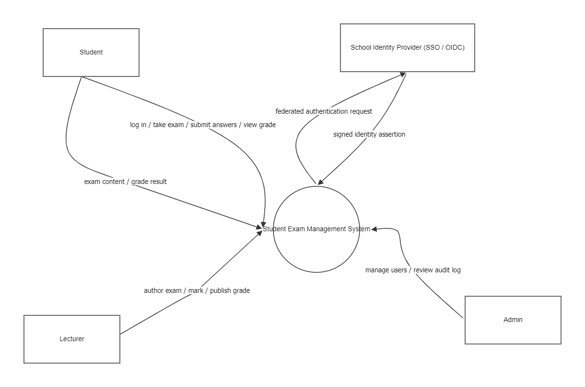
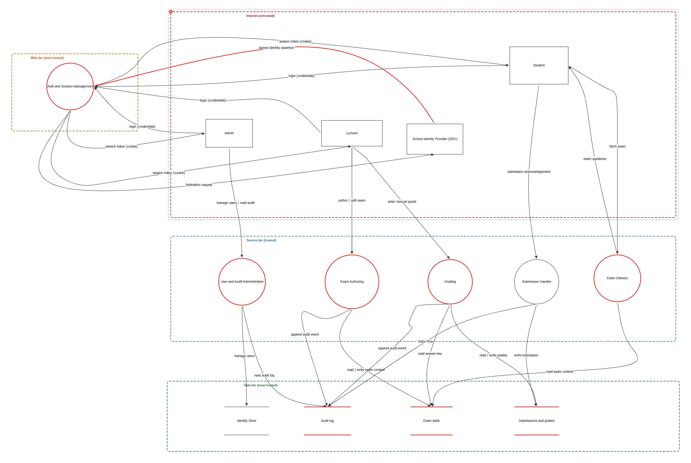
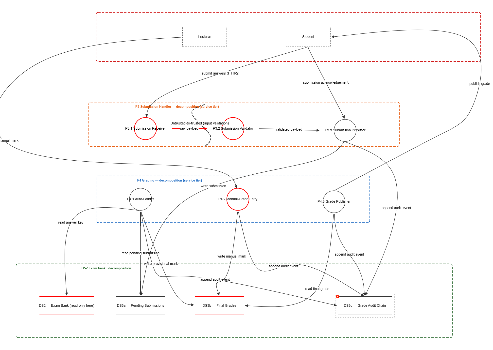
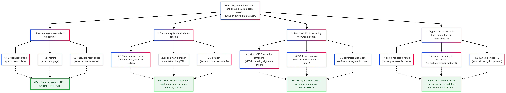

# Task B: Threat Modelling and Software Development Lifecycle

**Hypothetical application.** Student Exam Management System (SEMS): a web-based platform on which students sit timed exams, lecturers author and mark them, and an administrator manages users and audits activity.
**Methodology.** STRIDE for threat identification, DREAD for prioritisation, Data Flow Diagrams (DFDs) at three levels of decomposition, and a single threat tree for the highest-priority attack path.
**Tools.** OWASP Threat Dragon Desktop (version 2.6.0) for the Level 1 and Level 2 DFDs and the threat catalogue (OWASP, n.d.); the Mermaid Live Editor for the Level 0 context diagram and the threat tree.
**Reference style.** APA 7th Edition, British English throughout. Acronyms are spelled out on first use.

---

## 1. System under analysis

### 1.1 Roles and responsibilities

The Student Exam Management System has three internal user roles and one external system. Each interacts with a different part of the platform, so each defines a different attacker model and a different set of trust assumptions.

- **Student.** Authenticates, takes a timed exam during a published window, submits answers, and later views the released grade. Untrusted as a source of input.
- **Lecturer.** Authors exams and answer keys, marks open-ended answers, and publishes final grades. Trusted with respect to the platform but not with respect to dual-control workflows: a lecturer cannot approve their own grade changes after publication.
- **Administrator.** Manages user accounts, role assignments, and the audit log. Highest internal privilege; subject to separation-of-duties controls so that a single insider cannot both act and erase the trace of the action.
- **School Identity Provider (IdP).** External system reached by Single Sign-On (SSO) over OpenID Connect (OIDC) or Security Assertion Markup Language (SAML). The platform itself does not store passwords; it relies on signed identity assertions from the IdP. Treated as semi-trusted: assertion signatures are verified on every request.

### 1.2 Functional scope considered

The threat model covers the security-relevant slice of the platform:

- Authentication and session management, including federation with the IdP.
- Exam authoring, including answer-key storage and pre-publish editing.
- Exam delivery to students during the open window.
- Submission handling, decomposed in Level 2 into receipt, validation, and persistence.
- Grading, decomposed in Level 2 into automated marking, manual mark entry, and grade publication.
- User and audit administration, including read access to the append-only audit log.

Cosmetic features (notifications, dashboards, reporting) are out of scope. They do not change the attack surface of the assessable workflows.

### 1.3 Data sensitivity

Three data categories drive the threat priorities:

- **Answer keys** are pre-exam confidential. Any disclosure before the window opens collapses academic integrity for the affected cohort.
- **Submissions, marks, and final grades** contain personally identifiable information (PII) about students and are subject to the United Kingdom General Data Protection Regulation (UK GDPR), with consequent breach-notification obligations (Information Commissioner's Office [ICO], n.d.).
- **The audit log** is the evidence of record for any later dispute. Its integrity is what enables non-repudiation; its loss is what makes insider activity invisible.

These three sensitivities anchor the Critical and High DREAD bands in Section 6.

---

## 2. Methodology

### 2.1 The Microsoft Security Development Lifecycle loop

The threat model follows the four-stage cycle from the Microsoft Security Development Lifecycle: **Diagram**, then **Identify**, then **Mitigate**, then **Validate**, looping back to *Diagram* whenever the system changes (Howard & Lipner, 2006; Shostack, 2014). The DFDs in Section 4 satisfy *Diagram*; the STRIDE catalogue in Section 5 satisfies *Identify*; the mitigations in the same catalogue and the deep dive in Section 7 satisfy *Mitigate*; the SDLC integration in Section 9 wires *Validate* into the wider engineering lifecycle so the model continues to track the system as it changes.

### 2.2 STRIDE for threat identification

STRIDE categorises threats into six classes: Spoofing, Tampering, Repudiation, Information disclosure, Denial of service, and Elevation of privilege (Microsoft, n.d.; Shostack, 2014). The catalogue applies STRIDE *per element*: every process, data store, and data flow on the DFD is examined against the categories that apply to its element type. Actors are out of scope for STRIDE per the canonical method, since their compromise is modelled as a property of a connected flow or process.

### 2.3 DREAD for prioritisation

DREAD scores each identified threat across five dimensions on a 1–10 scale and divides the sum by five to produce a single risk number out of ten: **D**amage, **R**eproducibility, **E**xploitability, **A**ffected users, and **D**iscoverability (Microsoft, n.d.). Section 6 records the scores against the priority bands used in Section 7.

### 2.4 Threat tree for one critical attack path

A threat tree (also called an attack tree) decomposes a single high-priority goal into the partial steps an attacker would attempt, and attaches mitigations to each leaf (Shostack, 2014). One tree is built, for *authentication bypass during an active exam window*. Section 8 maps each branch back to a concrete entry in the catalogue.

### 2.5 Tooling and reproducibility

OWASP Threat Dragon produces both an editable JSON model and a self-contained PDF report directly from the diagram (OWASP, n.d.). The model files are committed in `evidence/` so any reader can re-import the model and reproduce every threat entry. The Level 0 context diagram and the threat tree are kept in Mermaid form because the artefact is small and a text source is more portable.

---

## 3. Notation and naming conventions

### 3.1 Element identifiers

Each DFD element carries a short identifier (P*n*, DS*n*, F*n*) so the catalogue tables remain compact, and a full descriptive name so the prose remains readable. The full name is preferred in running text; the identifier is used only when the full name has just appeared, when it would otherwise be repeated three times in a sentence, or inside a small table cell.

| Identifier | Element type | Full name                                    | Where it lives     |
| ---------- | ------------ | -------------------------------------------- | ------------------ |
| P1         | Process      | Auth and Session Management                  | Web tier           |
| P2         | Process      | Exam Delivery                                | Service tier       |
| P3         | Process      | Submission Handler (decomposed in Level 2)   | Service tier       |
| P4         | Process      | Grading (decomposed in Level 2)              | Service tier       |
| P5         | Process      | Exam Authoring                               | Service tier       |
| P6         | Process      | User and Audit Administration                | Service tier       |
| DS1        | Data store   | Identity store                               | Data tier          |
| DS2        | Data store   | Exam bank (questions and answer keys)        | Data tier          |
| DS3        | Data store   | Submissions and grades                       | Data tier          |
| DS4        | Data store   | Audit log                                    | Data tier          |
| P3.1       | Sub-process  | Submission Receiver                          | Level 2, P3 zone   |
| P3.2       | Sub-process  | Submission Validator (trust-elevation point) | Level 2, P3 zone   |
| P3.3       | Sub-process  | Submission Persister                         | Level 2, P3 zone   |
| P4.1       | Sub-process  | Auto-Grader                                  | Level 2, P4 zone   |
| P4.2       | Sub-process  | Manual-Grade Entry                           | Level 2, P4 zone   |
| P4.3       | Sub-process  | Grade Publisher                              | Level 2, P4 zone   |
| DS3a       | Sub-store    | Pending Submissions                          | Level 2, data tier |
| DS3b       | Sub-store    | Final Grades                                 | Level 2, data tier |
| DS3c       | Sub-store    | Grade Audit Chain                            | Level 2, data tier |

Trust boundaries are named rather than numbered: *Internet (untrusted)*, *Web tier (semi-trusted)*, *Service tier (trusted)*, and *Data tier (most trusted)*. Level 2 introduces internal boundaries inside P3 and P4 to mark the trust-elevation point at the input validator.

### 3.2 Acronyms used in this document

| Acronym | Expansion                                                                                           | First-use section |
| ------- | --------------------------------------------------------------------------------------------------- | ----------------- |
| CI      | Continuous Integration                                                                              | Section 9.4       |
| CSP     | Content Security Policy                                                                             | Section 7.4       |
| CWE     | Common Weakness Enumeration                                                                         | Section 5         |
| DFD     | Data Flow Diagram                                                                                   | Section 1         |
| DREAD   | Damage, Reproducibility, Exploitability, Affected users, Discoverability                            | Section 2.3       |
| GDPR    | General Data Protection Regulation                                                                  | Section 1.3       |
| HSTS    | HTTP Strict Transport Security                                                                      | Section 7.2       |
| HTTPS   | HyperText Transfer Protocol Secure                                                                  | Section 4.2       |
| IDOR    | Insecure Direct Object Reference                                                                    | Section 5.2       |
| IdP     | Identity Provider                                                                                   | Section 1.1       |
| MFA     | Multi-Factor Authentication                                                                         | Section 7.1       |
| OIDC    | OpenID Connect                                                                                      | Section 1.1       |
| OWASP   | Open Web Application Security Project                                                               | Section 2.5       |
| PII     | Personally Identifiable Information                                                                 | Section 1.3       |
| SAML    | Security Assertion Markup Language                                                                  | Section 1.1       |
| SDL     | Security Development Lifecycle                                                                      | Section 2.1       |
| SDLC    | Software Development Lifecycle                                                                      | Section 9         |
| SSDF    | Secure Software Development Framework                                                               | Section 9         |
| SSO     | Single Sign-On                                                                                      | Section 1.1       |
| STRIDE  | Spoofing, Tampering, Repudiation, Information disclosure, Denial of service, Elevation of privilege | Section 2.2       |
| TTL     | Time-To-Live                                                                                        | Section 7.4       |
| XSS     | Cross-Site Scripting                                                                                | Section 7.4       |

---

## 4. Data Flow Diagrams

Three diagrams sit on disk: the Level 0 context view, the Level 1 system decomposition, and a Level 2 decomposition of the most security-critical zone. **Elements drawn with a red outline carry one or more identified threats; elements with a black outline have no threat filed at that level.** Where an element has no Level 1 threat but is decomposed at Level 2 (P3, the Submission Handler), the threats are filed against its sub-processes.

### 4.1 Level 0: context

**Figure 1.** Level 0 context diagram. The platform is shown as a single process exchanging data with three internal actors and one external system (the school IdP). Trust boundaries are introduced from Level 1 onwards.

The Level 0 view answers a single question: *what crosses the boundary of the system?* Four flows do: the three role-driven flows from Student, Lecturer, and Administrator, and the federated authentication exchange with the IdP. Everything else is internal and is exposed at Level 1.

### 4.2 Level 1: system decomposition

**Figure 2.** Level 1 DFD with the four trust zones and the six core processes. Red outlines show every element that carries at least one identified threat. The Submission Handler (P3) carries no Level 1 threat annotation; its threats live at Level 2 because the security-critical detail is internal to that process.

The four trust zones map to a defence-in-depth posture (Lecture 2 calls this *Defence in depth*; the same idea appears in OWASP, 2021, A05 *Security Misconfiguration*):

- **Internet (untrusted).** Contains the actors and the IdP. All traffic crossing into the platform must be HTTPS-encrypted, authenticated, and rate-limited. Spoofing and credential-theft threats live here.
- **Web tier (semi-trusted).** Contains only Auth and Session Management (P1). Isolating P1 in its own zone reflects the principle of *Separation of duties*: identity decisions are made in a single, narrowly-scoped boundary that cannot be bypassed by the rest of the application.
- **Service tier (trusted).** Contains the five business-logic processes: Exam Delivery (P2), Submission Handler (P3), Grading (P4), Exam Authoring (P5), and User and Audit Administration (P6). Inputs reaching this tier have already been authenticated by P1 and validated by the application gateway, so the threats here are about authorisation, business-logic abuse, and lateral movement.
- **Data tier (most trusted).** Contains the four stores (DS1–DS4). Access is by service account with least-privilege database roles. Threats here concern direct read/write paths that bypass the service tier.

### 4.3 Level 2: Submission and Grading decomposition

**Figure 3.** Level 2 decomposition of the Submission Handler (P3) and Grading (P4) processes, showing the trust-elevation boundary at the input validator and the role-separated stores DS3a, DS3b, and DS3c. Red outlines again indicate elements with identified threats.

Submission and Grading were chosen for Level 2 because they sit at the convergence of three sensitive concerns: untrusted input from the Internet zone, the authoritative grade record, and the audit chain. A flaw inside any of these sub-processes would not be visible at Level 1.

The decomposition surfaces two structural facts:

- **The validator is the trust-elevation point.** Everything north of the Submission Validator (P3.2) is untrusted JSON; everything south of it has been schema-validated and time-checked. This is why the Level 2 trust boundary is drawn *through* P3, not around it. The dotted boundary inside the orange zone in Figure 3 is the canonical place to attach a Tampering threat against the *raw payload* data flow (Section 5.3, T8).
- **DS3 is split into three sub-stores.** Pending Submissions (DS3a), Final Grades (DS3b), and the Grade Audit Chain (DS3c) are role-separated at the database level. The grading service account writes to DS3a and DS3b but only appends to DS3c; the publisher reads from DS3b only. This is the structural mitigation that makes the *Repudiation* category recoverable in Section 5.3.

### 4.4 Trust-boundary rationale

Trust boundaries are the security-relevant lines on a DFD: they mark every place where data crosses from a less-trusted context to a more-trusted one (Shostack, 2014). The Level 1 model uses four zones because every additional zone is an extra crossing point that must be enforced in the implementation. The Level 2 decomposition adds two *internal* boundaries (P3 and P4) so that the trust-elevation point at P3.2 and the role separation inside P4 become visible without redrawing the Level 1 zones.

---

## 5. Threat catalogue

The catalogue records fifteen threats: nine on the Level 1 model and six on the Level 2 decomposition. Titles, STRIDE categories, severities, scores, and mitigation prose are taken directly from the Threat Dragon reports in `evidence/`.

### 5.1 STRIDE coverage matrix

Every STRIDE category is represented across the two diagrams, and Tampering, Information disclosure, and Elevation of privilege appear at both levels. These are the three categories most coupled to the system's high-value assets.

| Category                   | Level 1 threats                                 | Level 2 threats                |
| -------------------------- | ----------------------------------------------- | ------------------------------ |
| **S**poofing               | T1                                              | T9                             |
| **T**ampering              | T2, T3, T7                                      | T11, T12                       |
| **R**epudiation            | (covered structurally by DS4 and DS3c controls) | (covered structurally by DS3c) |
| **I**nformation disclosure | T4, T6, T11                                     | T8, T10                        |
| **D**enial of service      | T5                                              | —                              |
| **E**levation of privilege | T9-L1 (IDOR self-promotion)                     | T13                            |

Repudiation is mitigated structurally through the append-only audit log (DS4) and the Grade Audit Chain (DS3c), each of which records the immutable trail required to defeat after-the-fact denial.

### 5.2 Level 1 threat catalogue (nine threats)

The Level 1 numbering follows the Threat Dragon report. Numbers 8 and 10 are reserved by the tool for the Level 2 entries, which is why they are absent here.

| #   | Title                                                                 | STRIDE                 | Target                           | Severity | DREAD |
| --- | --------------------------------------------------------------------- | ---------------------- | -------------------------------- | -------- | ----- |
| 1   | Credential stuffing during open exam window                           | Spoofing               | P1 Auth and Session Management   | Critical | 8.2   |
| 2   | Tampering with the SSO identity assertion                             | Tampering              | F: signed identity assertion     | High     | 7.4   |
| 3   | Grade tampering via direct DS3 write from compromised grading service | Tampering              | P4 Grading                       | High     | 7.6   |
| 4   | Mass disclosure of grades and student PII via lateral movement        | Information disclosure | DS3 Submissions and grades       | Critical | 8.0   |
| 5   | Concurrent exam-start storm exhausts the application thread pool      | Denial of service      | P2 Exam Delivery                 | Critical | 8.4   |
| 6   | Pre-exam answer-key exposure via insecure direct object reference     | Information disclosure | P5 Exam Authoring                | High     | 7.2   |
| 7   | Insider with database admin rights deletes audit entries              | Tampering              | DS4 Audit log                    | Medium   | 6.0   |
| 9   | IDOR on role-assignment endpoint allows self-promotion                | Elevation of privilege | P6 User and Audit Administration | Critical | 8.6   |
| 11  | Pre-exam answer-key exposure via direct URL access                    | Information disclosure | DS2 Exam bank                    | High     | 7.4   |

Full attack narratives and mitigation sets per threat are reproduced from the Threat Dragon report in Appendix A and in `evidence/level_1_threat_model_report.md`.

### 5.3 Level 2 threat catalogue (six threats)

| #       | Title                                                                | STRIDE                 | Target                         | Severity | DREAD |
| ------- | -------------------------------------------------------------------- | ---------------------- | ------------------------------ | -------- | ----- |
| 8       | Verbose validator error leaks payload fragments                      | Information disclosure | F: raw payload                 | Medium   | 6.6   |
| 9 (L2)  | Session cookie theft enabling exam impersonation                     | Spoofing               | P3.1 Submission Receiver       | High     | 7.6   |
| 10      | Pre-exam answer-key exposure via unauthorised DS2 read               | Information disclosure | DS2 Exam Bank (read-only here) | High     | 7.4   |
| 11 (L2) | Grade tampering via direct DS3b write bypassing the grading workflow | Tampering              | DS3b Final Grades              | Critical | 8.0   |
| 12      | Submission replay — student resubmits after deadline                 | Tampering              | P3.2 Submission Validator      | Medium   | 6.0   |
| 13      | Manual-grade entry without re-authentication                         | Elevation of privilege | P4.2 Manual-Grade Entry        | High     | 7.6   |

The six Level 2 entries cover the three categories the decomposition was drawn to expose: trust-elevation failures at the validator, role separation inside DS3, and step-up authentication for high-impact writes.

### 5.4 Mapping STRIDE entries to OWASP Top 10 and CWE

Each catalogue entry maps to an OWASP Top 10 category (OWASP, 2021) and a Common Weakness Enumeration entry (MITRE, 2024).

| Threat                                   | OWASP Top 10 (2021)                            | CWE     |
| ---------------------------------------- | ---------------------------------------------- | ------- |
| T1 Credential stuffing                   | A07 Identification and Authentication Failures | CWE-307 |
| T2 SSO assertion tampering               | A02 Cryptographic Failures                     | CWE-345 |
| T4 Mass PII disclosure                   | A01 Broken Access Control                      | CWE-359 |
| T5 Exam-start storm DoS                  | A05 Security Misconfiguration                  | CWE-400 |
| T6 / T11 IDOR / direct URL on answer key | A01 Broken Access Control                      | CWE-639 |
| T8 Verbose error leak                    | A04 Insecure Design                            | CWE-209 |
| T9 (L2) Session cookie theft             | A07 Identification and Authentication Failures | CWE-294 |
| T9 (L1) IDOR self-promotion              | A01 Broken Access Control                      | CWE-285 |
| T11 (L2) Grade tampering via DS3b        | A04 Insecure Design                            | CWE-285 |
| T12 Submission replay                    | A04 Insecure Design                            | CWE-294 |
| T13 Manual-grade without re-auth         | A07 Identification and Authentication Failures | CWE-285 |

---

## 6. DREAD prioritisation

### 6.1 Master scoring table

The scores below are the values recorded inside Threat Dragon and visible in both report exports. Each score is the average of five 1–10 sub-scores; the per-dimension breakdown lives in the threat editor and is reproduced in Appendix A for the Critical band.

| #       | Threat                         | Severity | DREAD | Band     |
| ------- | ------------------------------ | -------- | ----- | -------- |
| 9 (L1)  | IDOR self-promotion            | Critical | 8.6   | Critical |
| 5       | Exam-start storm DoS           | Critical | 8.4   | Critical |
| 1       | Credential stuffing            | Critical | 8.2   | Critical |
| 4       | Mass PII disclosure            | Critical | 8.0   | Critical |
| 11 (L2) | Grade tampering via DS3b       | Critical | 8.0   | Critical |
| 9 (L2)  | Session cookie theft           | High     | 7.6   | High     |
| 13      | Manual-grade without re-auth   | High     | 7.6   | High     |
| 3       | Grade tampering via DS3        | High     | 7.6   | High     |
| 2       | SSO assertion tampering        | High     | 7.4   | High     |
| 11 (L1) | Pre-exam answer-key direct URL | High     | 7.4   | High     |
| 10      | Pre-exam answer-key DS2 read   | High     | 7.4   | High     |
| 6       | Pre-exam answer-key IDOR       | High     | 7.2   | High     |
| 8       | Verbose validator error        | Medium   | 6.6   | Medium   |
| 12      | Submission replay              | Medium   | 6.0   | Medium   |
| 7       | Audit-log insider deletion     | Medium   | 6.0   | Medium   |

### 6.2 Priority bands

Three bands are used. The boundaries correspond to the points at which the recommended engineering response changes.

- **Critical (DREAD 8.0 and above; 5 threats).** Mitigate before the system is allowed into production. Each Critical threat is expanded in Section 7 with a tailored mitigation set.
- **High (7.0 to 7.9; 7 threats).** Mitigate within the current release cycle. Mitigation prose in the Threat Dragon report is sufficient and is not rewritten here.
- **Medium (6.0 to 6.9; 3 threats).** Mitigate on a tracked timeline and monitor in production. None of these is a candidate for formal risk acceptance, since academic-record systems do not have headroom for integrity or repudiation risk.

No threat scores below 6.0.

---

## 7. Tailored mitigation: deep dive on the Critical band

Each Critical threat is described as the attack as it would appear in this architecture, the layered controls that defeat it, and the dependency on a specific Level 1 or Level 2 element.

### 7.1 T1: Credential stuffing during open exam window

The attacker replays passwords from public breach corpora against the login endpoint at the moment a scheduled exam window opens. Volume and timing are the point: a successful match grants a session indistinguishable from a real student's, and the open window provides predictable, valuable cover.

Tailored mitigations:

- **Mandatory MFA on every role.** No exemption for students. In an exam context, MFA prompt fatigue is acceptable; an authentication-bypass during an exam is not.
- **Per-account and per-IP rate limiting on `/login`.** Thresholds are configured against the recorded peak login rate of the largest cohort plus a 50% headroom; anything above is queued or rejected.
- **CAPTCHA after a small number of consecutive failures**, applied per account rather than per IP so that an attacker cannot rotate addresses to bypass it.
- **Integration with a breached-password API at password-set time**, so the password store never accepts a credential already known to be in a public corpus (this is OWASP, 2021, A07's specific recommendation).
- **Anomaly alerting on geographic or device deltas during exam windows**, escalated to the IdP team rather than buried in a generic SIEM queue.

The defence is layered: rate limiting raises the attacker's cost, breach-password rejection removes the cheapest path, and MFA closes the loop when the cost has been raised.

### 7.2 T4: Mass disclosure of grades and student PII

A single low-privilege foothold inside the service tier is pivoted laterally to the database account used by the grading service, and the entire student PII and grade record is exfiltrated in one query. This is the textbook path that GDPR breach notification was written for (UK Government, 2018; ICO, n.d.).

Tailored mitigations:

- **Column-level encryption** on student PII fields inside DS3, with the decryption key only released to processes that demonstrate a legitimate read context (Grade Publisher P4.3, never the validator P3.2).
- **Database role separation** between submission, grading, and publishing service accounts. The grading account has read on grades only (not on PII), and the publishing account has read on the published grade row only. No single account can perform the bulk read this threat depends on.
- **Egress alerting on bulk reads.** Any query that returns more than the 95th-percentile row count of normal traffic raises an alert; this is what catches the threat in flight even if all earlier defences fail.
- **Parameterised queries everywhere**, removing SQL injection as a foothold for the lateral move in the first place.

### 7.3 T5: Concurrent exam-start storm

Several thousand students start the same exam at the same scheduled minute. Each session triggers a synchronous read of the entire exam from the Exam bank, exhausting the application thread pool and the database connection pool. Legitimate students cannot start the exam. The exam schedule is public knowledge, which is what gives this threat its 8.4 DREAD score: discoverability is essentially 9.

Tailored mitigations:

- **Pre-fetch exam content into a per-session cache at seat allocation.** The cache is warmed in the minutes before the window opens, so the start spike is served from memory rather than from the database.
- **Connect-time admission control** when the live thread or connection pool exceeds capacity. Students see a queued progress indicator rather than a failed connection. This is *Fail Securely* in the Lecture 2 sense: degrading availability gracefully rather than failing into an inconsistent state.
- **Auto-scaling on connection-pool saturation**, with a lower bound sized to the largest scheduled cohort plus 50% headroom and an upper bound sized to control runaway costs.
- **Capacity-tested in CI** against the largest scheduled cohort plus headroom before each release. The test is a synthetic test that runs in the deployment pipeline (Section 9.4), not a production load test.

### 7.4 T9 (Level 1): IDOR on role assignment

The administrator's role-assignment endpoint takes a target user identifier and a target role from the request body. If the server-side authorisation check is missing or merely confirms the caller is authenticated rather than that the caller is an administrator, any logged-in student can issue a request that promotes their own account to lecturer or administrator. This is the highest-scoring threat in the catalogue (DREAD 8.6) because damage is total (Damage 10), affected users include every student (Affected 10), and the underlying pattern (CWE-285 *Improper Authorization*; CWE-639 *Authorization Bypass Through User-Controlled Key*) is a well-documented one.

Tailored mitigations:

- **Server-side authorisation check that resolves the caller's role on every request**, not just the caller's session presence. The role is read fresh from DS1 inside the request, never from the request body.
- **Default-deny on every privileged endpoint.** A role-changing action is rejected unless the resolved caller role is *administrator*, and the rejection is itself an audit event in DS4.
- **A canonical authorisation helper used by every privileged endpoint.** Rolling per-endpoint logic is exactly how this threat appears in real codebases.
- **Access-control test suite executed in CI on every change to authorisation code** (Section 9.4). The test fails the build if any privileged route is reachable without the correct role.

### 7.5 T11 (Level 2): Grade tampering via direct DS3b write

A compromised grading service account issues UPDATE or INSERT statements against the Final Grades sub-store directly, writing any grade without going through the audited workflow. The DREAD score (8.0) reflects that damage is high, reproducibility is high once the credential is in hand, and discoverability is moderate from the outside.

Tailored mitigations:

- **The grading service account is restricted to a stored-procedure interface**; no direct UPDATE rights on DS3b's grade columns.
- **The stored procedure validates** that the mark is within the allowed range and that the exam window has closed before the write commits.
- **A mandatory audit event** is appended to DS3c (the Grade Audit Chain) inside the same transaction. A grade write that fails to write its audit event rolls back.
- **Dual-control flag** for any post-publish grade change. A second lecturer or administrator must approve the change; the workflow records both identities.

---

## 8. Threat tree: authentication bypass during an active exam window

**Figure 4.** Threat tree for *authentication bypass and obtaining a valid student session during an active exam window*. Branches 1–4 enumerate the partial goals an attacker would attempt; the green leaves attach the layered mitigation set that defeats each branch.

### 8.1 Acronym legend for Figure 4

Acronyms in Figure 4:

- **MFA**: Multi-Factor Authentication.
- **CAPTCHA**: Completely Automated Public Turing test to tell Computers and Humans Apart.
- **TTL**: Time-To-Live (the validity period of a session token).
- **XSS**: Cross-Site Scripting.
- **SAML**: Security Assertion Markup Language.
- **OIDC**: OpenID Connect.
- **MITM**: Man-in-the-Middle.
- **IdP**: Identity Provider.
- **HTTPS**: HyperText Transfer Protocol Secure.
- **HSTS**: HTTP Strict Transport Security.
- **IDOR**: Insecure Direct Object Reference.
- **HttpOnly / SameSite**: cookie attributes that prevent client-side script access and cross-site replay.
- **CI**: Continuous Integration.

### 8.2 Branch-to-catalogue mapping

Every branch maps back to a concrete entry in the threat catalogue.

| Branch                                             | Attacker goal                                                  | Catalogue anchor                                                       |
| -------------------------------------------------- | -------------------------------------------------------------- | ---------------------------------------------------------------------- |
| 1. Reuse legitimate credentials                    | Credential stuffing, phishing, password-reset abuse            | T1 (Critical, DREAD 8.2)                                               |
| 2. Reuse a legitimate session                      | Cookie theft, token replay, session fixation                   | T9 Level 2 (High, DREAD 7.6)                                           |
| 3. Trick the IdP                                   | SAML/OIDC tampering, subject confusion, IdP misconfiguration   | T2 (High, DREAD 7.4)                                                   |
| 4. Bypass authorisation rather than authentication | Direct request to `/exam`, forced browsing, IDOR on student id | T9 Level 1 (Critical, DREAD 8.6) closest neighbour, same control class |

Branches 1, 2, and 3 are tracked as discrete catalogue entries because each has a different mitigation footprint. Branch 4 is the closest neighbour rather than the exact entry: T9 (Level 1) is filed against the role-assignment endpoint rather than against `/exam`, but the underlying fault is identical (a missing server-side authorisation check on a privileged route), so the mitigation set in Section 7.4 applies in full.

---

## 9. SDLC integration

Each Critical and High threat is mapped to one or more phases of the Software Development Lifecycle, using a six-phase view (Requirements, Design, Development, Testing, Deployment, and Maintenance) and aligning recommendations with the National Institute of Standards and Technology's Secure Software Development Framework (NIST, 2022).

### 9.1 Requirements

Outputs that this phase must produce before design begins:

- **Authentication and federation requirements.** MFA mandatory for every role; password store rejects breached credentials at set time (T1). Identity assertions must be signature-, audience-, and nonce-validated; the IdP signing key is pinned (T2).
- **Authorisation requirements.** Every privileged endpoint declares its required role explicitly; default-deny when the role cannot be resolved (T6, T9-L1, T11, T13).
- **Data-classification requirements.** PII fields are tagged at requirements time; column-level encryption is non-negotiable on any field carrying PII (T4).
- **Audit and non-repudiation requirements.** Every state-changing action (authentication, authoring, submission, grade write, role change) emits an audit event with the actor's identity, action, and timestamp (T7; structural mitigations for the Repudiation gap in Section 5.1).

These map to NIST SSDF practice *PO.1: Define Security Requirements for Software Development*.

### 9.2 Design

Outputs of the design phase:

- **DFDs at three levels** (this document, Section 4). The L2 decomposition is what surfaces the structural threats in Section 5.3.
- **Trust-zone model.** Four zones at Level 1, internal trust-elevation boundaries at Level 2 (Section 4.4).
- **Database role plan.** Per-service accounts; least privilege on every account; stored-procedure-only interface for high-impact writes (T11).
- **Validator placement.** P3.2 is the canonical trust-elevation point; no business logic upstream of it consumes raw input (T8, T12).
- **Threat catalogue and DREAD review** (Section 5–6) signed off as a precondition for development.

These map to NIST SSDF practices *PO.5: Implement and Maintain Secure Environments* and *PS.1: Protect All Forms of Code*.

### 9.3 Development

Coding-time controls anchored by the catalogue:

- **A canonical authorisation helper** used by every privileged route, with pull-request reviewers blocking any new endpoint that does not call it (T6, T9-L1, T11, T13).
- **Parameterised queries** on every database access path (T4).
- **Generic 4xx error handler** that returns a correlation ID only; verbose errors are logged server-side, never returned in the HTTP response (T8).
- **Server-issued single-use nonces** in the submission payload, validated against the server clock at P3.2 (T12).
- **Cookie attribute defaults** (HttpOnly, Secure, SameSite=Strict) configured globally; per-cookie overrides forbidden (T9-L2).

These map to NIST SSDF practice *PW.5: Create Source Code by Adhering to Secure Coding Practices*.

### 9.4 Testing

The catalogue defines what the test suite must cover:

- **Authentication and authorisation suite.** Property-based tests on the canonical authorisation helper; explicit tests that every privileged route rejects a non-administrator caller (T9-L1).
- **Session suite.** Tests that confirm cookie attributes are set; tests that reject expired and replayed tokens (T9-L2, T12).
- **Capacity test in CI.** Synthetic exam-start-storm test exercising the pre-fetch cache and admission control under the largest cohort + 50% headroom (T5). This is the test that has to fail the build, not merely warn.
- **Static analysis.** A SAST (Static Application Security Testing) job hunts for the patterns that lead to T4 and T8: direct-interpolation SQL, unhandled exceptions returned to the response, and unencrypted PII columns. This pipeline is the deliverable of Task C and is referenced rather than reproduced here.
- **Dynamic analysis.** A DAST (Dynamic Application Security Testing) job, the deliverable of Task D, exercises authentication, IDOR, and XSS paths against a deployed instance. T1, T6, and T9-L1 are the catalogue threats most directly probed.

These map to NIST SSDF practices *PW.7: Review and/or Analyze Human-Readable Code* and *PW.8: Test Executable Code*.

### 9.5 Deployment

- **HTTPS with HSTS preload** at the edge; assertion validation refuses any plain-HTTP fall-back (T2).
- **Auto-scaling configuration** sized to the largest scheduled cohort + 50% headroom; admission control wired into the load balancer (T5).
- **Database service accounts created with least-privilege roles**; production grading account has no UPDATE on DS3b grade columns outside the stored-procedure interface (T11).
- **Audit log shipped on creation to a separate trust zone** (a write-once medium or an external SIEM), so deletion in the primary database does not erase the trail (T7).
- **Software Bill of Materials** (SBOM) generated in the deployment pipeline so the supply-chain surface is recorded against every release. This is the deliverable of Task E.

These map to NIST SSDF practices *PS.3: Archive and Protect Each Software Release* and *RV.1: Identify and Confirm Vulnerabilities on an Ongoing Basis*.

### 9.6 Maintenance

- **Threat-model review** is triggered by every change to authentication, authorisation, the validator, the role-assignment endpoint, or the audit pipeline. The trigger is a pull-request label, not a calendar.
- **Dependency vulnerability monitoring** runs against the SBOM; any new advisory affecting a deployed component opens an issue with the affected catalogue threat tagged.
- **Egress-bulk-read alerts and authentication-anomaly alerts** route to a named on-call rota with documented response procedures (T1, T4).
- **Quarterly penetration testing** focused on the Critical band: T1, T4, T5, T9-L1, and T11-L2.
- **Audit chain integrity check.** Periodic hash-anchor comparison between DS4 and the off-platform write-once store catches insider deletion (T7).

These map to NIST SSDF practices *RV.2: Assess, Prioritize, and Remediate Vulnerabilities* and *RV.3: Analyze Vulnerabilities to Identify Their Root Causes*.

---

## 10. Limitations and assumptions

- **Hypothetical system, no implementation.** No live application backs the diagrams, so threats are not measured against running code. Where a measurement would change a DREAD dimension, the score is the engineering-judgement value Threat Dragon recorded; the report file makes this transparent.
- **Single-author review.** The Threat Dragon report's *Reviewer* field is blank; this is module portfolio work without a peer reviewer. In a production setting the catalogue would be reviewed by the architect, a senior developer, and a tester before sign-off (Shostack, 2014, ch. 17).
- **Out-of-scope features.** Notifications, dashboards, reporting, and any third-party plagiarism integration are out of scope. The exam-bank plagiarism check is the most likely candidate for a Level 3 decomposition in a follow-on review.
- **Threat-tree depth.** Only one tree was built. The threat with the next-highest case for a tree (T11-L2 grade tampering) is left to a future iteration; its branches would be largely subsumed by the Section 7.5 mitigation set.
- **DREAD is subjective.** The scores are defensible but not measured. A FAIR-style quantitative model would change the absolute numbers without changing the priority ordering, which is what the engineering decisions actually depend on.

---

## 11. Figures and evidence index

All figures referenced in this README live in `dfd-diagrams/` or `threat-tree/`. The Threat Dragon model JSON files and the report exports live in `evidence/` so the catalogue is reproducible.

| Figure | Description                                                                       | File                                             |
| ------ | --------------------------------------------------------------------------------- | ------------------------------------------------ |
| 1      | Level 0 context diagram                                                           | `dfd-diagrams/DFD_level_0.png`                   |
| 2      | Level 1 Data Flow Diagram with trust boundaries and per-element threat indicators | `dfd-diagrams/DFD_level_1.png`                   |
| 3      | Level 2 decomposition of the Submission Handler and Grading processes             | `dfd-diagrams/DFD_level_2.png`                   |
| 4      | Threat tree for authentication bypass during an active exam window                | `threat-tree/auth-bypass-during-exam-window.png` |

| Artefact                    | Description                              | File                                       |
| --------------------------- | ---------------------------------------- | ------------------------------------------ |
| Level 1 Threat Dragon model | JSON for the Level 1 DFD (re-importable) | `evidence/DFD_level_1.json`                |
| Level 2 Threat Dragon model | JSON for the Level 2 DFD (re-importable) | `evidence/DFD_level_02.json`               |
| Level 1 threat report (PDF) | Threat Dragon report export              | `evidence/level_1_threat_model_report.pdf` |
| Level 2 threat report (PDF) | Threat Dragon report export              | `evidence/level_2_threat_report.pdf`       |

---

## 12. References

Howard, M., & Lipner, S. (2006). *The security development lifecycle: A process for developing demonstrably more secure software*. Microsoft Press.

Information Commissioner's Office. (n.d.). *Personal data breaches: A guide*. ICO. https://ico.org.uk/for-organisations/uk-gdpr-guidance-and-resources/personal-data-breaches/personal-data-breaches-a-guide/

Microsoft. (n.d.). *Microsoft Threat Modeling Tool threats*. Microsoft Learn. https://learn.microsoft.com/en-us/azure/security/develop/threat-modeling-tool-threats

MITRE. (2024). *Common Weakness Enumeration (CWE)*. The MITRE Corporation. https://cwe.mitre.org/

National Institute of Standards and Technology. (2022). *Secure software development framework (SSDF) version 1.1: Recommendations for mitigating the risk of software vulnerabilities* (NIST SP 800-218). U.S. Department of Commerce. https://doi.org/10.6028/NIST.SP.800-218

OWASP. (n.d.). *OWASP Threat Dragon (version 2.6.0)* [Computer software]. The OWASP Foundation. https://owasp.org/www-project-threat-dragon/

OWASP. (2021). *OWASP Top 10:2021*. The OWASP Foundation. https://owasp.org/Top10/

Shostack, A. (2014). *Threat modeling: Designing for security*. Wiley.

UK Government. (2018). *Data Protection Act 2018*, c.12. https://www.legislation.gov.uk/ukpga/2018/12/contents

---

## Appendix A: Threat Dragon report excerpts

The full attack narratives and mitigation prose for every threat in Sections 5.2 and 5.3 are reproduced verbatim in the Threat Dragon Markdown reports that ship alongside this README:

- `evidence/level_1_threat_model_report.pdf`: nine Level 1 threats.
- `evidence/level_2_threat_report.pdf`: six Level 2 threats.
