# Task C: Automated Security Testing

**Application under test.** A deliberately vulnerable Flask marketplace (`task-c/vulnerable-web-app/app.py`).
**SAST scanners.** Bandit and Semgrep OSS, run in parallel using GitHub Actions.
**Pipeline definition.** [`.github/workflows/sast.yml`](../.github/workflows/sast.yml).
**Output formats.** JSON (human-readable) and SARIF (GitHub Security tab integration).

---

## 1. Pipeline design and workflow

The CI/CD pipeline is defined in a single GitHub Actions workflow file (`sast.yml`) that triggers on every push or pull request to `main` when any file under `task-c/` changes. Two jobs run in parallel on `ubuntu-latest`, each following the same four-stage pattern: checkout and environment setup, scan with results written to disk, enforcement check, and artefact upload.

**Figure 1.** Pipeline architecture. Both jobs export results in JSON and SARIF formats. SARIF files are uploaded to the GitHub Security tab via the CodeQL `upload-sarif` action; JSON and SARIF files are saved as downloadable workflow artefacts.

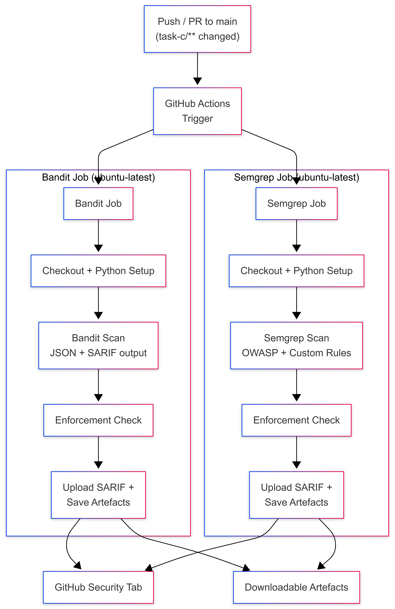

The Bandit job installs `bandit[sarif]`, scans the `task-c/vulnerable-web-app/` directory, writes results in both formats with `--exit-zero` (so the files are always created), then runs a second invocation without `--exit-zero` as the enforcement check. That check fails the job when any finding exists:

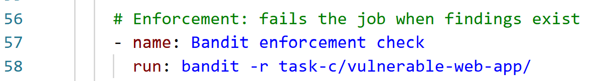

The Semgrep job follows the same structure but uses two rule sources: the community `p/owasp-top-ten` registry and a custom rule file at `task-c/semgrep-rules/custom-rules.yaml`. Two Django-specific rules are excluded at pipeline level via `--exclude-rule` flags (Section 4.2 explains why). The enforcement step uses `--error` to exit non-zero on findings:

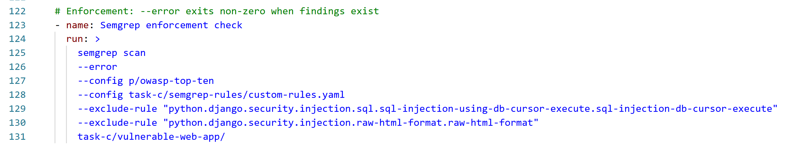

Both jobs fail as expected because the application contains genuine vulnerabilities. The `if: always()` condition on the upload steps ensures SARIF and artefact uploads proceed regardless of the enforcement outcome.

**Figure 2.** GitHub Actions summary page. Both jobs fail (red crosses). The Artefacts section at the bottom provides downloadable scan results in both formats.

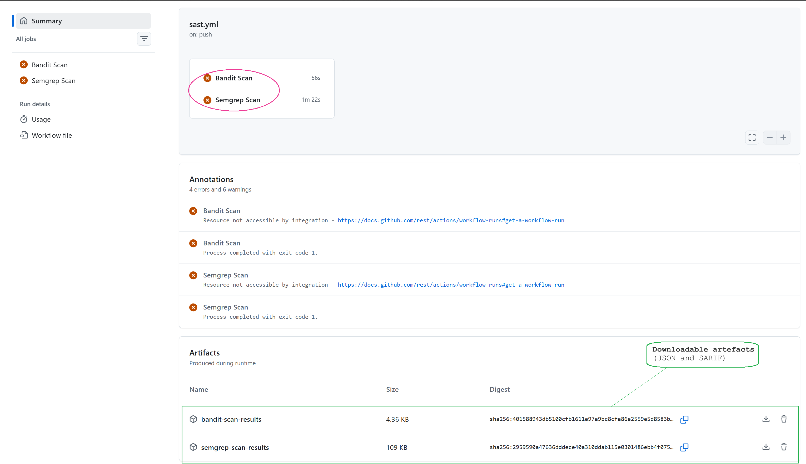

**Figure 3.** Semgrep job detail. All steps complete except the enforcement check (red cross), which confirms that findings exist. The SARIF upload and artefact save steps still execute because of the `if: always()` condition.

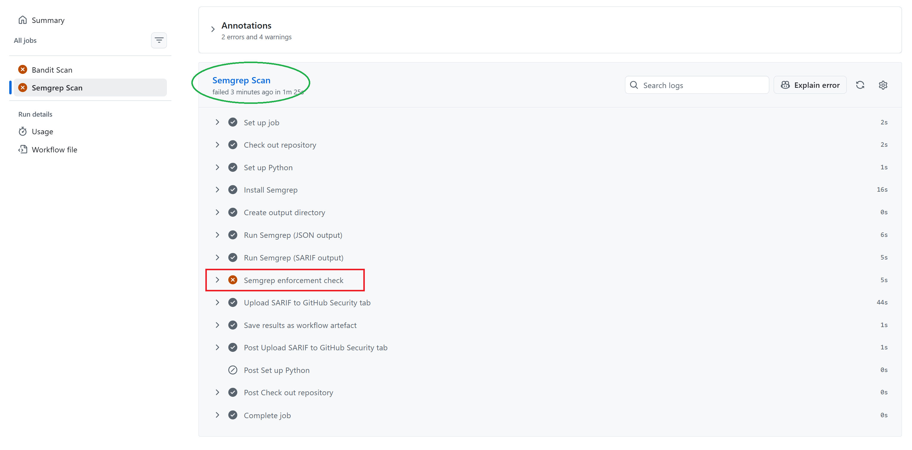

---

## 2. Scanner selection rationale

Bandit and Semgrep were chosen because they address different layers of the same codebase with complementary detection strategies.

**Bandit** (PyCQA, n.d.) is a Python-specific AST-based scanner. It walks the abstract syntax tree and matches individual node patterns against a library of security checks. Its strength is high-signal detection of Python-specific issues: f-string SQL queries (B608), hardcoded secrets (B105), and dangerous runtime configurations such as `debug=True` (B201). Its limitation is that it operates on single statements; it cannot trace data flow across function boundaries or detect output-layer vulnerabilities such as cross-site scripting (XSS).

**Semgrep** (Semgrep, Inc., n.d.) is a language-agnostic pattern-matching engine that supports taint-mode analysis. The `p/owasp-top-ten` ruleset maps directly to the OWASP Top 10 (OWASP, 2021), providing rules for injection, XSS, security misconfiguration, and other categories. Semgrep traces data from user-controlled sources (`request.form`, `request.cookies`) through to dangerous sinks (`conn.execute()`, `return html`), which is why it detects XSS patterns that Bandit misses entirely. The `p/owasp-top-ten` ruleset was chosen over `p/ci` because it provides broader vulnerability coverage aligned to an industry-standard taxonomy rather than a curated subset optimised for low noise in continuous integration.

A custom Semgrep rule was written to detect a gap in the community rulesets. Neither Bandit nor the `p/owasp-top-ten` registry flags `set_cookie()` calls missing the `httponly` parameter. The custom rule (`flask-set-cookie-missing-httponly`) uses Semgrep's `pattern` / `pattern-not` syntax to match any `set_cookie()` call that does not include `httponly=True`:

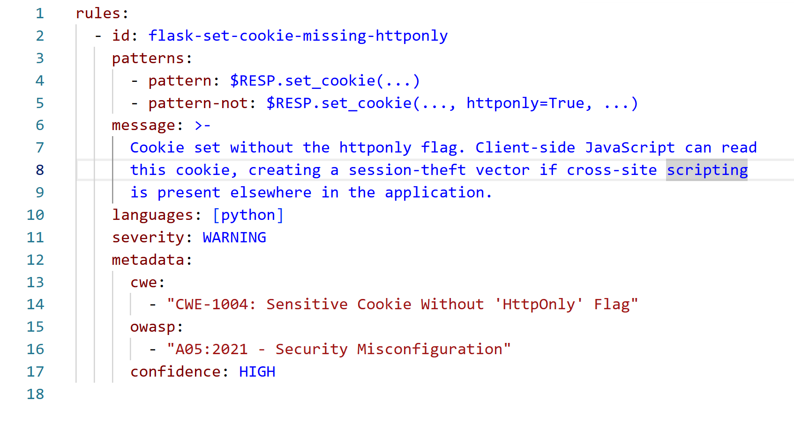

This rule detected the `set_cookie` call at [app.py](vulnerable-web-app/app.py) where the authentication cookie is set without `httponly`:

```python
146    resp.set_cookie('username', user['username'])
```

---

## 3. Scan output and observations

### 3.1 Bandit results

Bandit reported 18 findings across `app.py`. The breakdown by test ID:

| Test ID | Rule name                   | Count | Severity | Confidence           |
| ------- | --------------------------- | ----- | -------- | -------------------- |
| B608    | `hardcoded_sql_expressions` | 16    | Medium   | Low (14), Medium (2) |
| B105    | `hardcoded_password_string` | 1     | Low      | Medium               |
| B201    | `flask_debug_true`          | 1     | High     | Medium               |

All 16 B608 findings flag f-string SQL queries where user-controlled values from `request.form` or `request.cookies` are interpolated directly into SQL strings. The pattern is consistent across the application: every database query is constructed this way.

**Figure 4.** One representative Bandit finding (B105) showing the hardcoded secret key at line 11.

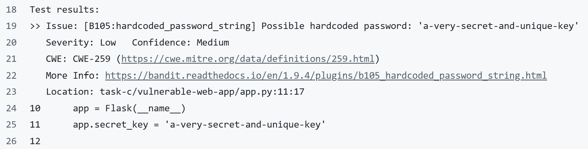

### 3.2 Semgrep results

Semgrep was run twice: once with the full `p/owasp-top-ten` ruleset (47 findings), and once with 21 Django-specific false positives excluded via `--exclude-rule` (26 findings). The post-exclusion breakdown:

| Rule ID (abbreviated)                        | Category         | Count | Severity |
| -------------------------------------------- | ---------------- | ----- | -------- |
| `tainted-sql-string`                         | SQL Injection    | 16    | Error    |
| `directly-returned-format-string`            | XSS              | 4     | Warning  |
| `raw-html-concat.raw-html-format`            | XSS              | 4     | Warning  |
| `flask-set-cookie-missing-httponly` (custom) | Misconfiguration | 1     | Warning  |
| `debug-enabled`                              | Misconfiguration | 1     | Warning  |

Semgrep's taint-mode analysis detected the same 16 SQL injection sites as Bandit, plus 8 XSS findings that Bandit's AST-only approach cannot reach, plus the `debug=True` misconfiguration, plus the custom-rule cookie finding.

**Figure 5.** Semgrep finding for tainted SQL string at line 98, showing the taint source (`request.form`) flowing into an f-string SQL query.

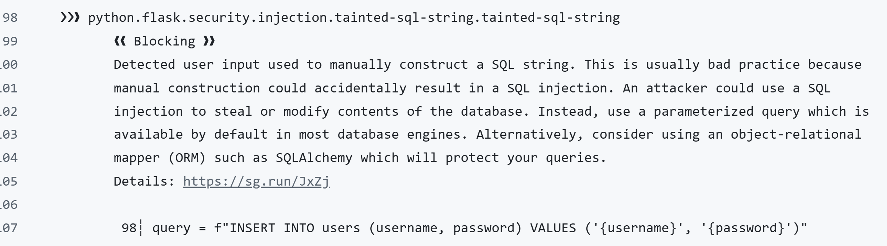

**Figure 6.** Semgrep finding for raw HTML concatenation (XSS) at lines 440–447, showing user input flowing into a manually constructed HTML string in the admin panel route.

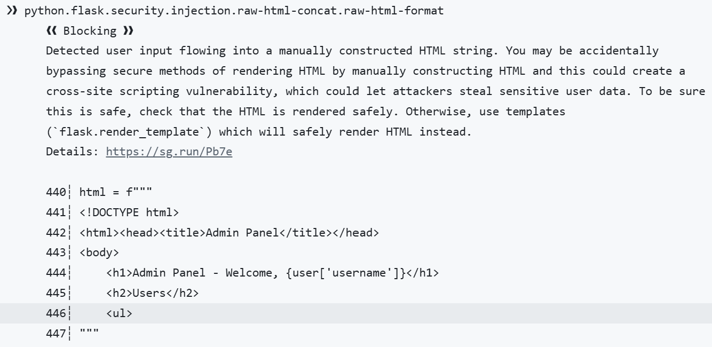

### 3.3 Semgrep scan summary

**Figure 7.** Semgrep scan summary (post-exclusion). 26 findings across 6 files, all 26 classified as blocking. 151 rules evaluated; scan completed successfully.

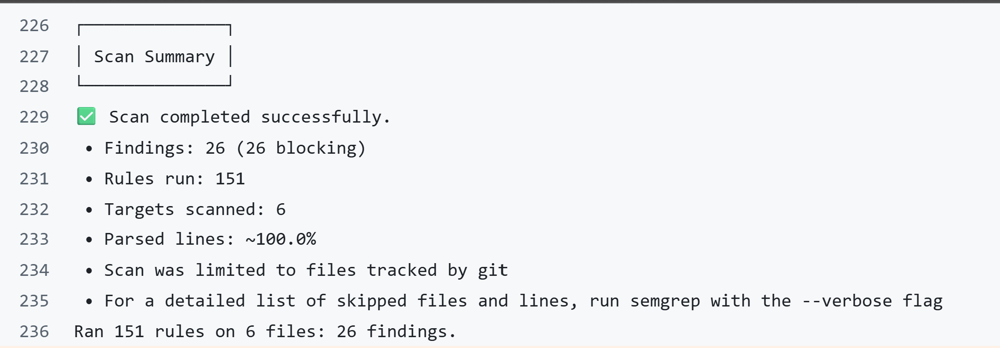

---

## 4. Finding classification and disposition

### 4.1 Triage methodology

Every finding from both scanners was reviewed against the `app.py` source code and classified into one of three categories: true positive (genuine, exploitable vulnerability), false positive (scanner misidentification due to framework mismatch or rule imprecision), or accepted risk (known issue retained for pedagogical purposes). Figure 8 illustrates this classification workflow.

**Figure 8.** Finding classification funnel. Raw scanner output is deduplicated across tools, reviewed against the source, classified, and entered into the register below.

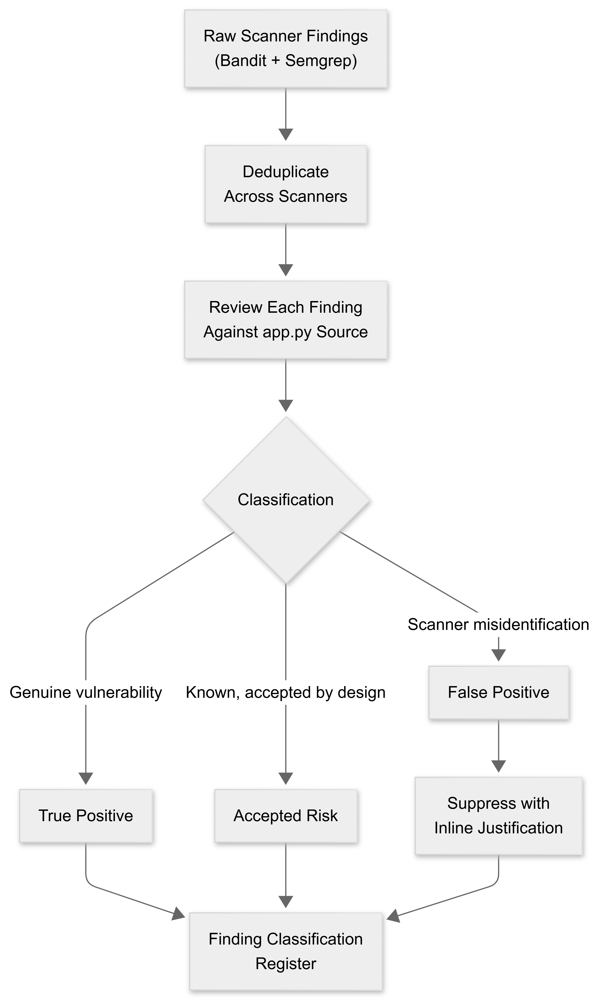

### 4.2 False positive disposition: Django-specific rules

Before exclusion, Semgrep reported 47 findings. Of these, 21 came from two Django-specific rules:

- `python.django.security.injection.sql.sql-injection-using-db-cursor-execute` (20 findings)
- `python.django.security.injection.raw-html-format.raw-html-format` (1 finding)

These rules are designed for Django's ORM and template engine. They fire on this Flask application because the `p/owasp-top-ten` ruleset bundles both Django and Flask rules together. The Django SQL injection rule recommends using "Django's QuerySets, which are built with query parameterisation" — advice that does not apply to a Flask/SQLite application (Figure 9). The Django HTML rule recommends `django.shortcuts.render` instead of manual HTML construction, which is similarly inapplicable.

**Figure 9.** One of the 21 Django false positives. The rule recommends Django QuerySets on a Flask application, confirming a framework mismatch rather than a genuine vulnerability.

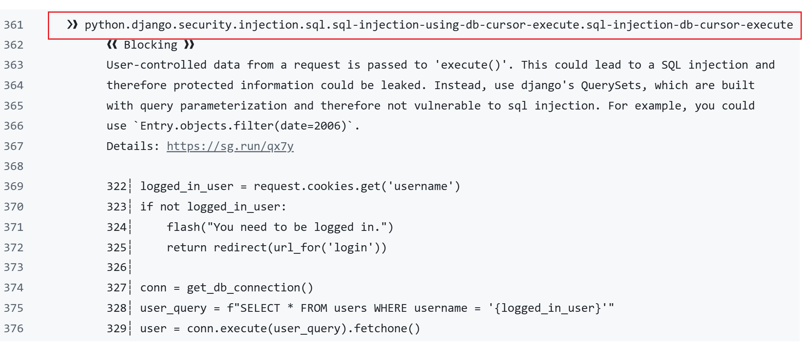

These 21 findings were suppressed at the pipeline level using `--exclude-rule` flags rather than inline `nosemgrep` comments. This decision was made for two reasons. First, the Django SQL injection rule uses multi-line taint analysis that spans from the cookie read (e.g. line 322) through to the `execute()` call (e.g. line 329); a single-line `nosemgrep` comment does not reliably suppress multi-line taint matches. Second, the false positive applies to the entire rule, not to specific lines, so pipeline-level exclusion is the correct scope.

**Figure 10.** GitHub Security tab before suppression: 65 open alerts (Bandit + Semgrep combined), 0 closed. The Django false positives inflate the alert count.

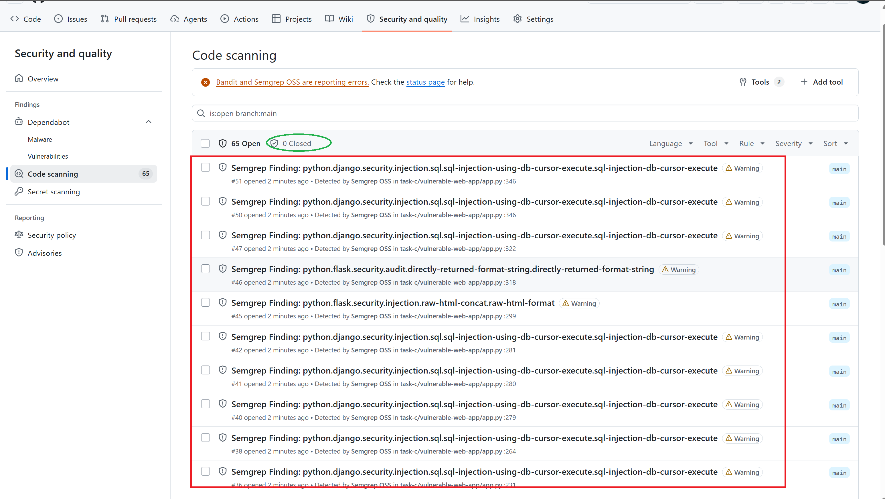

**Figure 11.** GitHub Security tab after suppression: 44 open, 21 closed as "fixed". The closed alerts correspond exactly to the excluded Django rules.

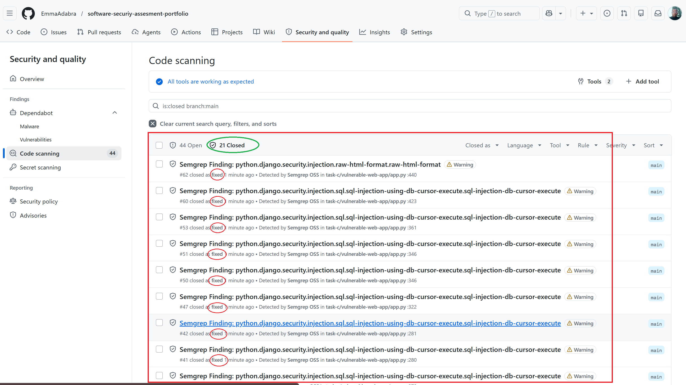

### 4.3 Finding classification register

The register below consolidates all genuine findings after deduplication. Where both Bandit and Semgrep flag the same line, the row records both scanners and notes the overlap. Findings are grouped by vulnerability class rather than listed per-line, because the same pattern (f-string SQL query, raw HTML return) repeats across multiple routes.

| #   | Vulnerability class              | CWE        | Scanner(s)       | Rule ID(s)                                                    | Lines in `app.py`                                                            | Count | Severity       | Verdict        | Cross-ref          |
| --- | -------------------------------- | ---------- | ---------------- | ------------------------------------------------------------- | ---------------------------------------------------------------------------- | ----- | -------------- | -------------- | ------------------ |
| 1   | SQL Injection                    | CWE-89     | Bandit, Semgrep  | B608, `tainted-sql-string`                                    | 21, 98, 140, 192, 221, 233, 270, 283, 291, 328, 336, 352, 362, 370, 373, 429 | 16    | Medium / Error | True positive  | Task B: T4, Task D |
| 2   | Cross-Site Scripting (Reflected) | CWE-79     | Semgrep only     | `directly-returned-format-string`                             | 70, 318, 419, 462                                                            | 4     | Warning        | True positive  | Task D             |
| 3   | Cross-Site Scripting (Stored)    | CWE-79     | Semgrep only     | `raw-html-concat.raw-html-format`                             | 299–317, 391–402, 405, 440–447                                               | 4     | Warning        | True positive  | Task D             |
| 4   | Hardcoded secret key             | CWE-259    | Bandit only      | B105                                                          | 11                                                                           | 1     | Low            | True positive  | Task B: T2         |
| 5   | Debug mode enabled (RCE risk)    | CWE-94/489 | Bandit, Semgrep  | B201, `debug-enabled`                                         | 465                                                                          | 1     | High / Warning | True positive  | —                  |
| 6   | Missing HttpOnly cookie flag     | CWE-1004   | Semgrep (custom) | `flask-set-cookie-missing-httponly`                           | 146                                                                          | 1     | Warning        | True positive  | Task D             |
| 7   | Django framework mismatch        | —          | Semgrep          | `sql-injection-db-cursor-execute`, `raw-html-format` (Django) | Multiple                                                                     | 21    | Warning        | False positive | —                  |

---

## 5. Representative finding analysis

This section examines three vulnerability classes in depth, tracing each from the scanner alert through the source code to the security impact.

### 5.1 SQL injection cluster (16 sites)

Every database query in `app.py` uses Python f-strings to interpolate user input directly into SQL statements. The login route is representative:

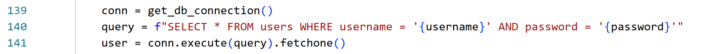

The variables `username` and `password` come from `request.form` (line 136–137) with no sanitisation. An attacker can supply `' OR '1'='1' --` as the username to bypass the `WHERE` clause entirely, returning the first row in the `users` table regardless of the password.

Both scanners detect this pattern. Bandit flags the f-string as B608 (CWE-89) because it recognises the `f"SELECT ...` pattern as string-based query construction. Semgrep's `tainted-sql-string` rule traces the data flow from the `request.form` source through the f-string construction to the `conn.execute()` sink, confirming the taint reaches a dangerous operation.

The same pattern repeats in the registration route (line 98), the product CRUD operations (lines 192, 221, 233, 270, 283, 291), and the review system (lines 362, 370, 373). The `DELETE` route at line 336 is notable because it also lacks ownership verification: any authenticated seller can delete any product by ID, combining SQL injection (CWE-89) with a missing authorisation check that no SAST tool detects (Section 6).

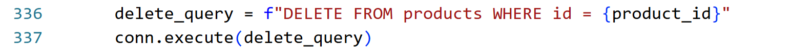

The remediation is parameterised queries. For example, line 140 should use `conn.execute("SELECT * FROM users WHERE username = ? AND password = ?", (username, password))`. This approach separates data from code, making injection structurally impossible regardless of input content (OWASP, n.d.).

### 5.2 XSS and insecure cookie chain

The application constructs HTML responses by concatenating f-strings rather than using Flask's `render_template()` with Jinja2 auto-escaping. Semgrep detects two distinct XSS patterns:

**Directly returned format strings** (4 findings). Routes such as `product_page` (line 318) and `admin_panel` (line 462) return `html` variables built from f-string concatenation. User-controlled data from the database (product names, descriptions, review comments) is interpolated without escaping:

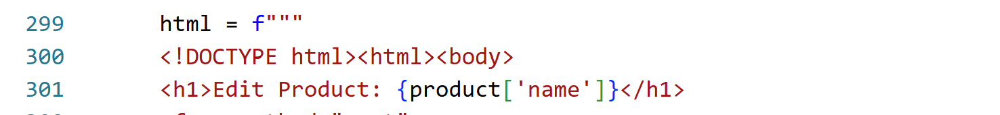

If a product name contains `<script>alert('XSS')</script>`, the script executes in the browser of any user who views the edit page.

**Raw HTML concatenation** (4 findings). The product detail page (lines 391–402) and admin panel (lines 440–447) build HTML strings with user data embedded directly:

[app.py](vulnerable-web-app/app.py)

```python
405    html += f"<li>{review['author_name']}: {review['comment']}</li>"
```

A stored XSS payload in a review comment persists in the database and executes for every subsequent visitor.

The insecure cookie at line 146 compounds the XSS risk. The authentication cookie is set without `httponly=True`:

[app.py](vulnerable-web-app/app.py)

```python
146    resp.set_cookie('username', user['username'])
```

Without `HttpOnly`, client-side JavaScript can read the cookie via `document.cookie`. An XSS payload can therefore exfiltrate the session identifier to an attacker-controlled server, enabling session hijacking. This attack chain — stored XSS (CWE-79) combined with a missing HttpOnly flag (CWE-1004) — demonstrates how two individually "medium" findings combine into a high-impact exploit path (Task D can confirm this with runtime exploitation).

Bandit detects none of the XSS findings. Its AST-based approach analyses individual statements rather than tracing data flow from source to sink, so it cannot determine whether a returned string contains user input.

### 5.3 Hardcoded secret and debug mode

The Flask secret key is assigned as a literal string at line 11:

[app.py](vulnerable-web-app/app.py)

```python
11    app.secret_key = 'a-very-secret-and-unique-key'
```

Bandit flags this as B105 (CWE-259). The secret key is used by Flask to sign session cookies cryptographically. If an attacker recovers this value (from the source code, a Git history, or a debug traceback), they can forge arbitrary session cookies and impersonate any user.

The debug mode at line 465 worsens this:

[app.py](vulnerable-web-app/app.py):

```python
465    app.run(debug=True)
```

Both Bandit (B201, CWE-94) and Semgrep (`debug-enabled`, CWE-489) flag this line. When `debug=True`, Flask exposes the Werkzeug interactive debugger, which allows arbitrary Python code execution directly from the browser if an exception occurs (Pallets, n.d.). In combination with the hardcoded secret key, an attacker who triggers an error page gains a full remote code execution (RCE) pathway.

---

## 6. Tool limitations and coverage gaps

### 6.1 Comparative detection matrix

| Vulnerability class         | Bandit       | Semgrep (OWASP) | Semgrep (custom) | Neither      |
| --------------------------- | ------------ | --------------- | ---------------- | ------------ |
| SQL Injection (CWE-89)      | Detected     | Detected        | Not applicable   | —            |
| XSS — reflected (CWE-79)    | Not detected | Detected        | Not applicable   | —            |
| XSS — stored (CWE-79)       | Not detected | Detected        | Not applicable   | —            |
| Hardcoded secret (CWE-259)  | Detected     | Not detected    | Not applicable   | —            |
| Debug mode (CWE-489)        | Detected     | Detected        | Not applicable   | —            |
| Missing HttpOnly (CWE-1004) | Not detected | Not detected    | Detected         | —            |
| CSRF (CWE-352)              | Not detected | Not detected    | Not detected     | Not detected |
| Authorisation bypass        | Not detected | Not detected    | Not detected     | Not detected |
| Plaintext password storage  | Not detected | Not detected    | Not detected     | Not detected |

The table shows that running both scanners together provides broader coverage than either alone. Bandit catches the hardcoded secret (its pattern-based B105 check recognises assignment to `secret_key`), while Semgrep catches the XSS family (its taint analysis traces user input through to HTML output). The custom rule fills a gap that neither community ruleset addresses. The "Neither" column identifies the classes of vulnerability that static analysis cannot detect by design.

### 6.2 Bandit's detection boundary

Bandit operates at the single-statement level. It can match syntactic patterns such as `f"SELECT ... {var}"` against its rule library, but it cannot determine whether `var` is user-controlled or whether the returned value reaches a dangerous sink. This means:

- It detects SQL injection with **low confidence** (14 of 16 findings are flagged as `CONFIDENCE.LOW`) because it cannot confirm the interpolated variable comes from user input. The pattern match is correct, but the tool cannot distinguish a hardcoded constant from an attacker-controlled form field.
- It has **no XSS rules at all**. Detecting XSS requires tracing data from a web input source to an HTML output sink across multiple statements, which is beyond AST-level pattern matching.
- It does not analyse cookie attributes. The `set_cookie()` call at line 146 is syntactically valid Python; detecting the missing `httponly` keyword argument requires semantic understanding of the Flask API that Bandit's rule library does not include.

### 6.3 Semgrep's cross-framework noise

The `p/owasp-top-ten` ruleset bundles rules for multiple Python web frameworks (Flask, Django, FastAPI) into a single registry. When run against a Flask application, Django-specific rules fire as false positives. In this scan, 21 of the initial 47 Semgrep findings (45%) were Django false positives. The Django SQL injection rule recommended "Django's QuerySets, which are built with query parameterisation" on code that uses raw `sqlite3` cursors; the Django HTML rule recommended `django.shortcuts.render` on a Flask application that does not use Django's template engine.

This noise rate is operationally significant. A development team receiving 47 alerts when only 26 are genuine would waste triage effort on false positives, potentially leading to alert fatigue where genuine findings are dismissed. The solution applied here — pipeline-level `--exclude-rule` flags — is effective but requires manual identification of the irrelevant rules. A more mature approach would use Semgrep's `technology` metadata filter to restrict rule execution to the frameworks actually present in the codebase.

### 6.4 What SAST cannot detect

Static analysis examines source code without executing it. Three classes of vulnerability in `app.py` are invisible to both scanners:

**Cross-site request forgery (CSRF).** The `/delete/<id>` route (line 320) accepts GET requests and performs a destructive database operation. An attacker can embed `` in any page to trigger deletion when a logged-in user loads it. Detecting CSRF requires understanding that a state-changing operation is accessible via an unsafe HTTP method without a token check — a logic-level assessment that no pattern-matching or taint-tracing rule can perform reliably.

**Authorisation bypass.** The delete route checks whether the user is a seller or admin but does not verify whether the user owns the product being deleted. Any seller can delete any other seller's products. This is a business-logic flaw that depends on the application's intended access control model, which is not expressed in the code in a way a SAST rule can parse.

**Plaintext password storage.** The registration route (line 98) stores `password` directly in the database without hashing. Neither scanner flags this because there is no syntactic pattern that reliably distinguishes "a variable named `password` being stored" from any other string insertion. Detecting this would require the scanner to understand that `password` has a specific semantic meaning and that storing it without a transformation is a security defect.

These gaps are where dynamic application security testing (DAST) and manual code review add value. Figure 12 maps the detection boundaries of SAST (this task) against the runtime analysis performed in Task D.

**Figure 12.** SAST vs DAST coverage. SAST detects source-code patterns, hardcoded secrets, and configuration flaws. DAST detects runtime injection, authentication bypass, and session handling issues. SQL injection and XSS sit in the overlap, detectable by both approaches through different mechanisms.

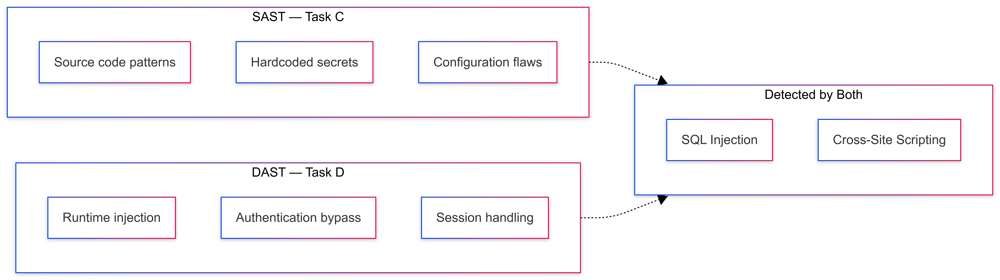

---

## 7. Figures and evidence index

| Figure | Description                                                | File                                                               |
| ------ | ---------------------------------------------------------- | ------------------------------------------------------------------ |
| 1      | Pipeline architecture diagram                              | `diagram/pipeline_architecture.png`                                |
| 2      | GitHub Actions summary with downloadable artefacts         | `evidence/github_action_home_page_with_downloadable_artefacts.png` |
| 3      | Semgrep job detail showing enforcement check failure       | `evidence/semgrep_check_fail_other_process_passed.png`             |
| 4      | Bandit finding: hardcoded password string (B105)           | `evidence/one_example_of_many_vulnerabilty_found_by_bandit.png`    |
| 5      | Semgrep finding: tainted SQL string at line 98             | `evidence/one_example_of_many_vulnerabilty_found_semgrep.png`      |
| 6      | Semgrep finding: raw HTML concatenation (XSS)              | `evidence/one_example_of_many_vulnerabilty_found_by_semgrep.png`   |
| 7      | Semgrep scan summary (26 findings, post-exclusion)         | `evidence/semgrep_scan_result_after_suppression.png`               |
| 8      | Finding classification funnel                              | `diagram/finding_classification_funnel.png`                        |
| 9      | Django false positive recommending QuerySets on Flask      | `evidence/one_example_of_many_false_postives.png`                  |
| 10     | GitHub Security tab before suppression (65 open)           | `evidence/github_security_page_before_suppress.png`                |
| 11     | GitHub Security tab after suppression (44 open, 21 closed) | `evidence/github_security_and_quality_page_after_suppression.png`  |
| 12     | SAST vs DAST coverage comparison                           | `diagram/SAST_vs_DAST.png`                                         |

Raw scan outputs are stored in `task-c/scan-results/`. The Bandit results are in `bandit-scan-results/bandit-results.json` and `.sarif`. The Semgrep results are stored in two subdirectories: `semgrep/before-suppress/` (47 findings, full ruleset) and `semgrep/after-suppress-rule/` (26 findings, Django rules excluded). The custom Semgrep rule is at `task-c/semgrep-rules/custom-rules.yaml`.

---

## 8. References

MITRE. (2024a). *CWE-79: Improper neutralization of input during web page generation ('Cross-site scripting')*. The MITRE Corporation. https://cwe.mitre.org/data/definitions/79.html

MITRE. (2024b). *CWE-89: Improper neutralization of special elements used in an SQL command ('SQL injection')*. The MITRE Corporation. https://cwe.mitre.org/data/definitions/89.html

MITRE. (2024c). *CWE-259: Use of hard-coded password*. The MITRE Corporation. https://cwe.mitre.org/data/definitions/259.html

MITRE. (2024d). *CWE-489: Active debug code*. The MITRE Corporation. https://cwe.mitre.org/data/definitions/489.html

MITRE. (2024e). *CWE-1004: Sensitive cookie without 'HttpOnly' flag*. The MITRE Corporation. https://cwe.mitre.org/data/definitions/1004.html

OWASP. (2021). *OWASP Top 10:2021*. OWASP Foundation. https://owasp.org/Top10/

OWASP. (n.d.). *SQL injection*. OWASP Foundation. https://owasp.org/www-community/attacks/SQL_Injection

Pallets. (n.d.). *Debugging application errors*. Pallets Projects. https://flask.palletsprojects.com/en/stable/debugging/

PyCQA. (n.d.). *Bandit: A tool designed to find common security issues in Python code* [Computer software]. https://bandit.readthedocs.io/

Semgrep, Inc. (n.d.). *Semgrep: Lightweight static analysis for many languages* [Computer software]. https://semgrep.dev/
