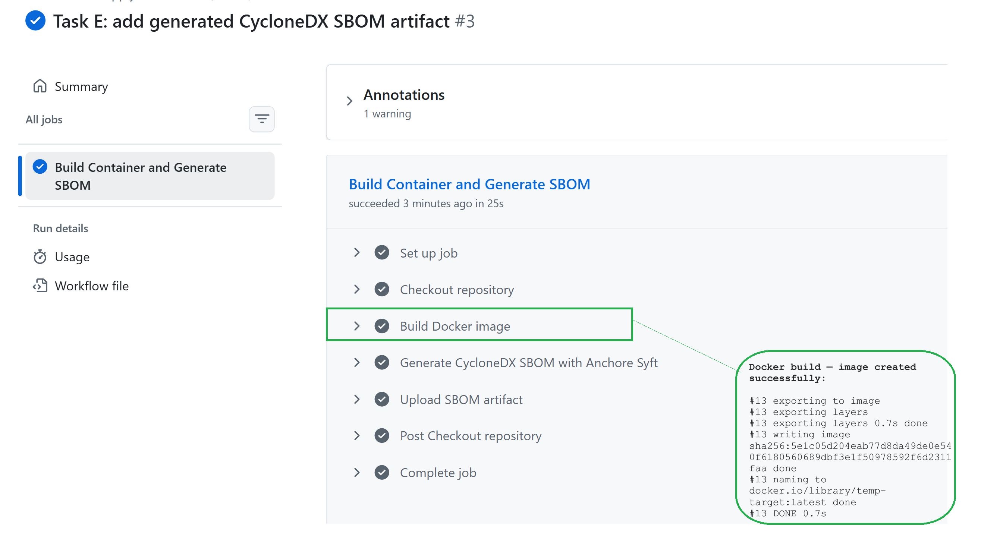
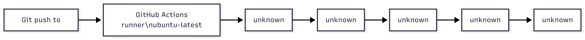
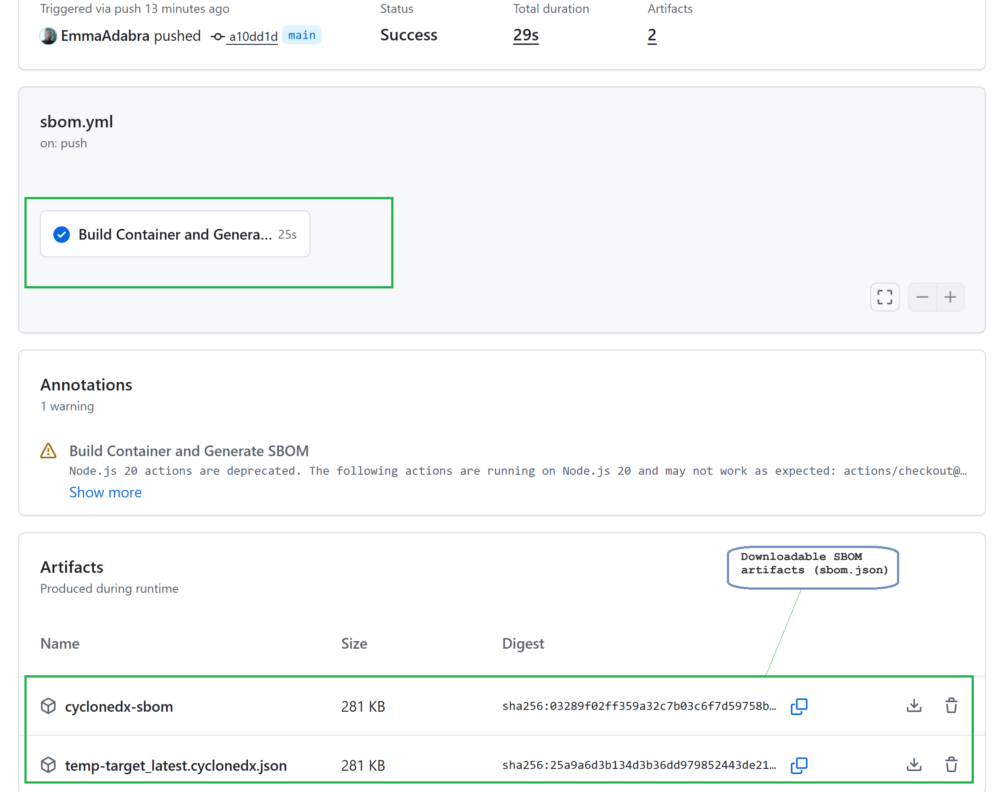
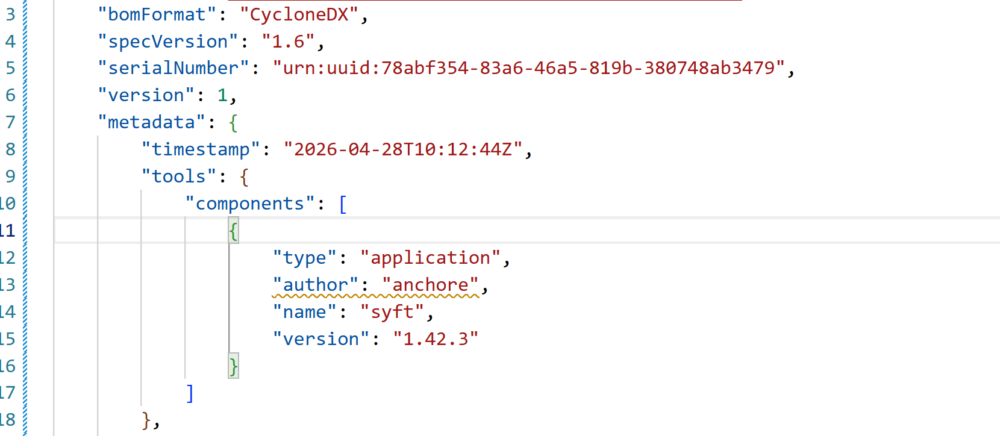
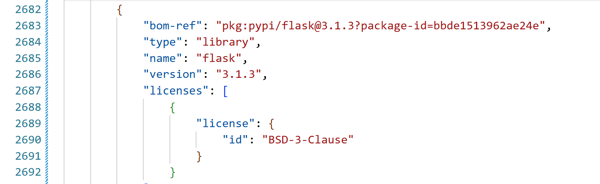

# Task E: Compliance and Supply Chain

**Application under audit.** The Flask marketplace from Tasks C and D, containerised at [`task-e/`](.).
**Pipeline.** [`.github/workflows/sbom.yml`](../.github/workflows/sbom.yml). Push to `main` builds the image and runs Anchore Syft against it.
**Output.** CycloneDX 1.6 SBOM at [`sbom-artifacts/sbom.json`](sbom-artifacts/sbom.json). The file lists every component Syft identified in the compiled image, across the Debian base, the Python runtime, and the application layer.
**Cross-references.** [`task-a/fixed.c`](../task-a/fixed.c), [`task-c/README.md`](../task-c/README.md), [`task-d/README.md`](../task-d/README.md), [`.github/workflows/sast.yml`](../.github/workflows/sast.yml).

---

## 1. Scope

Three things were produced for this task: a Dockerfile that compiles the application into a container, a GitHub Actions workflow that scans the compiled image with Syft on every push, and a CycloneDX JSON SBOM committed as the audit artefact. Section 5 maps each of these against four SSDF practice IDs.

---

## 2. Container build

### 2.1 Dockerfile

The base image is pinned to a specific patch version. A floating tag would let upstream changes enter the image silently between builds.

[`Dockerfile`](Dockerfile)

```dockerfile
7    FROM python:3.9.18-slim
```

A non-root user is created and assumed before the application starts. Any compromise of the Flask process is contained to `appuser`.

[`Dockerfile`](Dockerfile)

```dockerfile
23    RUN adduser --disabled-password --gecos "" appuser
24    USER appuser
```

The [`.dockerignore`](.dockerignore) excludes `database.db`, `.env`, `__pycache__/`, `*.pyc`, `*.log`, and `.git` from the build context. The exclusion of `database.db` is the most significant: the file is generated at runtime by `init_db.py` and contains the seeded `admin` credentials.

### 2.2 Build inside the pipeline

The image is built on the GitHub-hosted runner, not on any developer machine. Figure 1 is the run page for the workflow defined in [`.github/workflows/sbom.yml`](../.github/workflows/sbom.yml). The job `Build Container and Generate SBOM` ran in 25 seconds. The expanded callout shows the runner's `docker build` step writing the image and tagging it `docker.io/library/temp-target:latest`. The same runner then passes that tag to Syft (Section 3).

**Figure 1.** Workflow run page showing the `Build Docker image` step succeeding inside the pipeline.



The application inside the container still has the runtime flaws Task D exploited. The brief for this task is supply chain compliance, not application hardening; Section 6 records this honestly.

---

## 3. Automated SBOM pipeline

### 3.1 Workflow

The trigger is a push to the protected branches.

[`.github/workflows/sbom.yml`](../.github/workflows/sbom.yml)

```yaml
3    on:
4      push:
5        branches: [ "main", "master" ]
```

The runner is a fresh GitHub-hosted Ubuntu VM. It has no persistent state and is destroyed when the job ends.

[`.github/workflows/sbom.yml`](../.github/workflows/sbom.yml)

```yaml
10        runs-on: ubuntu-latest
```

The build step compiles the same Dockerfile from Section 2 inside the runner.

[`.github/workflows/sbom.yml`](../.github/workflows/sbom.yml)

```yaml
16          - name: Build Docker image
17            run: docker build -t temp-target:latest ./task-e
```

The scan step calls the official Anchore action against the image just built on the runner and forces CycloneDX JSON.

[`.github/workflows/sbom.yml`](../.github/workflows/sbom.yml)

```yaml
19          - name: Generate CycloneDX SBOM with Anchore Syft
20            uses: anchore/sbom-action@v0
21            with:
22              image: "temp-target:latest"
23              format: "cyclonedx-json"
24              output-file: "sbom.json"
```

The upload step persists the JSON past the runner's destruction.

[`.github/workflows/sbom.yml`](../.github/workflows/sbom.yml)

```yaml
26          - name: Upload SBOM artifact
27            uses: actions/upload-artifact@v4
28            with:
29              name: cyclonedx-sbom
30              path: sbom.json
```

### 3.2 Pipeline architecture

The five steps above run in the order shown in Figure 2: a push to `main` triggers the runner, which checks out the code, builds the image, scans it with Syft, and uploads the SBOM.

**Figure 2.** Pipeline architecture for the Task E supply chain audit workflow.



### 3.3 Pipeline run and uploaded artefact

Figure 3 presents the run summary for the build referenced in Section 2.2. The workflow was triggered by a push event to the `main` branch and completed successfully. The Artifacts panel at the bottom of the page lists `cyclonedx-sbom` as a downloadable artefact. This artefact corresponds to the SBOM stored in [`sbom-artifacts/sbom.json`](sbom-artifacts/sbom.json), which is referenced in Section 4.

**Figure 3.** GitHub Actions run summary for the SBOM workflow, showing the trigger, the 25-second build, and the uploaded `cyclonedx-sbom` artefact.



---

## 4. Generated SBOM

### 4.1 Metadata block

The header section records metadata describing the SBOM, including the specification standard used, the generating tool, and the timestamp of creation. The serial number uniquely identifies the SBOM instance for this specific run, while the timestamp links the artefact to the workflow execution shown in Figure 3. The recorded Syft version identifies the scanner responsible for generating the component inventory.

**Figure 4.** Metadata block from the generated SBOM.



### 4.2 Components

Each entry in the `components` array represents a software component identified within the compiled container image. The Flask record shown in Figure 5 is one example of such an entry.

The highlighted fields correspond to the minimum data elements defined by the National Telecommunications and Information Administration (NTIA, 2021): a unique reference identifier (`bom-ref`, derived here from the package URL), the component name, its exact version, and its associated licence information. This structure is repeated consistently for all components listed within the array.

While [`requirements.txt`](requirements.txt) specifies only a direct dependency, the `components` array also captures transitive dependencies automatically resolved by `pip`, in addition to operating-system packages inherited from the Python `3.9.18-slim` base image. In contrast, Task C’s SAST scanner, such as Bandit and Semgrep which analyse Python source code only and therefore cannot detect packages introduced through the container base image.

**Figure 5.** Components array entry for `flask 3.1.3` in the generated SBOM.



---

## 5. NIST SSDF mapping

| Practice                                      | ID         | Artefact in this repository                                                                                                     |
| --------------------------------------------- | ---------- | ------------------------------------------------------------------------------------------------------------------------------- |
| Protect the software (tamper-resistant build) | **PS.1.1** | [`.github/workflows/sbom.yml`](../.github/workflows/sbom.yml) lines 3 to 10; the run page in Figure 3                           |
| Maintain provenance data                      | **PW.4.1** | [`sbom-artifacts/sbom.json`](sbom-artifacts/sbom.json) metadata block and components array; Figures 4 and 5                     |
| Identify vulnerabilities continuously         | **RV.1.1** | [`sbom-artifacts/sbom.json`](sbom-artifacts/sbom.json) `bomFormat` and `specVersion`; YAML line 23 sets the format              |
| Review and harden code                        | **PW.6**   | [`task-a/fixed.c`](../task-a/fixed.c); [`.github/workflows/sast.yml`](../.github/workflows/sast.yml); Dockerfile lines 23 to 24 |

### 5.1 PS.1 (tamper-resistant build environment)

The build is defined in YAML, runs on a runner no developer can log into, and is triggered only by commits already in version control. Lines 3 to 10 set the trigger. Line 10 sets the runner. The run page in Figure 3 is the audit record.


### 5.2 PW.4 (provenance data for all components)

To verify whether `Flask 3.1.3` is included in a release, the analyst can inspect [`sbom-artifacts/sbom.json`](sbom-artifacts/sbom.json) and search for the entry `pkg:pypi/flask@3.1.3`. The SBOM provides a complete inventory of packaged components and their exact versions. In the absence of an SBOM, confirming this information would typically require accessing a running container and enumerating installed dependencies using a command such as `pip list`. See Figure 5.

### 5.3 RV.1 (continuous vulnerability identification)

The flag `format: "cyclonedx-json"` on line 23 of the workflow forces a machine-readable output. CycloneDX JSON is the format Aqua Trivy and OWASP Dependency-Track ingest directly. The same SBOM file can be re-queried against any CVE feed published after this build, without rebuilding the image.


### 5.4 PW.6 (review and harden code)

Three artefacts in the wider portfolio support PW.6. The buffer overflow in [`task-a/fixed.c`](../task-a/fixed.c) is patched with bounds-checked input. The SAST pipeline at [`.github/workflows/sast.yml`](../.github/workflows/sast.yml) runs Bandit and Semgrep on every push and feeds the triage register in [`task-c/README.md`](../task-c/README.md). The Dockerfile command (lines 23 to 24) drops privileges to `appuser` before the application starts, applying the same principle at the deployment layer.


---

## 6. Limitations

**Snapshot, not continuous scan.** The SBOM is accurate as of the timestamp in Figure 4. New CVEs disclosed against `flask 3.1.3` after that timestamp are not reflected in the file. Operational value depends on the SBOM being consumed by a monitor that runs after each disclosure.

**Compliance is not security.** The same image whose components are audited here still contains the SQL injection, stored XSS, and `HttpOnly`-less authentication cookie demonstrated dynamically in Task D. The SBOM proves what is shipped, not whether what is shipped is safe.

**Provenance is not authenticity.** PURL and version match the package the build resolved, not the identity of whoever published it. A typosquatted library would appear in the SBOM with a plausible PURL. Defending against that requires signed artefacts (for example via Sigstore Cosign), which is not in scope here.

---

## 7. Figures and evidence index

| Figure | Description                                                                 | File                                         |
| ------ | --------------------------------------------------------------------------- | -------------------------------------------- |
| 1      | `docker build` terminal output, image tagged successfully                   | `evidence/docker_build_success.png`          |
| 2      | Pipeline architecture flowchart                                             | `evidence/pipeline_architecture_and_run.png` |
| 3      | GitHub Actions run page, all steps green                                    | `evidence/github_actions_run_green.png`      |
| 4      | SBOM metadata block: `bomFormat`, `specVersion`, `serialNumber`, Syft entry | `evidence/sbom_metadata_block.png`           |
| 5      | SBOM components array entry for `flask 3.1.3`                               | `evidence/sbom_components_snippet.png`       |

The full SBOM is at [`sbom-artifacts/sbom.json`](sbom-artifacts/sbom.json). The pipeline is at [`.github/workflows/sbom.yml`](../.github/workflows/sbom.yml). The Dockerfile is at [`Dockerfile`](Dockerfile).

---

## 8. References

Anchore. (n.d.). *Syft* [Computer software]. Anchore Inc. https://github.com/anchore/syft

CycloneDX. (n.d.). *CycloneDX specification overview*. OWASP Foundation. https://cyclonedx.org/specification/overview/

National Institute of Standards and Technology. (2022). *Secure software development framework (SSDF) version 1.1: Recommendations for mitigating the risk of software vulnerabilities* (NIST SP 800-218). U.S. Department of Commerce. https://doi.org/10.6028/NIST.SP.800-218

National Telecommunications and Information Administration. (2021). *The minimum elements for a software bill of materials (SBOM)*. U.S. Department of Commerce. https://www.ntia.gov/report/2021/minimum-elements-software-bill-materials-sbom

The White House. (2021). *Executive Order 14028: Improving the nation's cybersecurity*. Federal Register. https://www.federalregister.gov/documents/2021/05/17/2021-10460/improving-the-nations-cybersecurity
